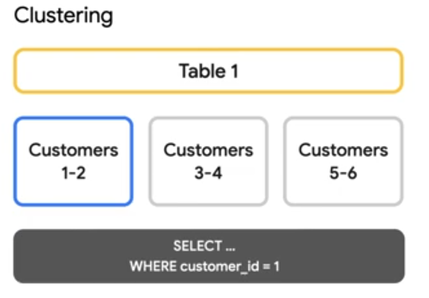

# Big Query Introduction for beginners

- __Big Query__ is a data service by GCP. Its a higly scalable data warehouse and processing component. Here you can do all ETL transformations.

- __Serverless__ - Yoo need not take the responsibility of managing the infratsructure based on the load. The Big Query user just need to focus on writing the code, the complete infratructure related problem will be handled by GCP. So for GCP its not serverless as they have to maintain it - scale it up or scale it down.

- AWS has RedShift instead of BigQuery.

- Advantages of BigQuery:
    - It supports both batch ingestion(eg: table or a file) and streaming data ingestion (eg: streaming and real time transactions).
    - Supports AI and ML
    - Fully managed service (serverless)
    - Highly scalable
    - Pay as you go model => Cost savings
    - Automated data transfer
    - Access Control for security
    - Easy integration with other GCP products like BigTable(NoSQL product), Google Drive spreadsheets, CLoudSQL(RDBMS product) or spanner. 
    - Federated Queries: You need not duplicate the data i.e., you can process the data in say, CloudSQL and then pull it to BigQuery. So data migration from CloudSQL/Google Drive is not needed only the processed/computed data can be pulled by BigQuery.
    - So you can run a query from BigQuery on top of Google Drive without migrating or duplicating the data to BigQuery. So BigQuery acts like a data lake processing framework component as only in data lake compoent can do compute when storage is in another system.
    - Auto backup - Data will be replicated so if a particular node goes down your data is not lost as it will be in another node.
    - Any changes you do to table the changes will be stored for 7 days so that you can see different time versions of the data for 7 days.
    - Programmatic Integrations - It gives support to different programmatic language APIs say JAVA, Python, PHP, C-sharp,etc. 
    - BigQuery used for data ingestion, data storage, data processing or analytics and visualization(BI tools).These are the four most important layer.
    

## BigQuery Architecture

- Any query engine will need 2 things: storage and compute(processing).
- In BigQuery, storage and compute are decoupled(seperate) so they are cost efficient. 
- Bigquery has many layers. 1st layer used for data storage is called __Colossus__. Its a distributed/cluster level file system and it also maintains the replication. Compute engine used by bigquery is __Dremel__. Dremel has root server, mixers and leaf nodes. Leaf node helps us to read data from storage i.e., Colossus. Mixers are layers where your aggragations based on the SQL queries take place.
- Dremel and Colossus are connected via __Jupiter__ which is a high speed network protocol. The whole architecture is orchestrated with __Borg__. The complete triggering and schedueling happens with Borg.
    

- BigQuery stores all its data in Colossues in format of Column-oriented. 
- Consider this data:
    | Sno | Name | Salary |
    |-----|------|--------|
    | 1   | A    | 100    |
    | 2   | B    | 200    |
    | 3   | C    | 300    |

    In the above, for row-oriented when we do an aggregation say sum(salary), then the query will read the whole row and then pick salary for aggregation.
    
    But in column oriented, data is stored as columns and when you trigger sum(salary) it will ignore unnecessary reading/scanning of unnecessary columns and only look at Salary column.

- Colossues stores all your BigQuery data in a column-oriented format known as __capacitors__.

- Datasets in BigQuery => Databases

## Partitions in BigQuery

- Partition decides the performance of query. In BigQuery, its important how it works.
- __Full-scan__ => Reading each row of a table's column to find a particular value. So, say if in city column we are searching for Pune then even if its in the last row, the whole rows of the table will be scanned to find the rows having Pune value.
- Partitions help in reducing scanning. Its like table of contents for book. And based on the table of contents we can quickly move to that page.
- We start with the most used column to create the partition. Eg in CV data: Date is the first partition column, Country is the 2nd best column and so on. Based on the partition columns only the user has to write queries to __prune__ their reads. Make sure the partition in query is also applied based on the order of the best partition columns i.e., Date, country and so on.
- __Pruning__ means your partition is working and your join queries work optimally.


Refer: [Introduction to clustered tables - BigQuery docs](https://cloud.google.com/bigquery/docs/clustered-tables)

## Types of partition
Partition cannot be created in any columns in BigQuery, There are some types of partition:
1. __Integer based partition__: Here you define a range of integer values 0 to 10, 101 to 10000, etc. If your data comes out of range then all your data will come into unpartitioned-partition data.

Sample query for it is:
```
CREATE TABLE project-id.dataset_name.new_table
select col1, col2 
from tableA
PARTITION BY RANGE_BUCKET (SID, GENERATE_ARRAY(0,100,10))

```
`RANGE_BUCKET` is a keyword here.  
__0 to 100__ is the record count. __0 to 10__ one partition. __11 to 20__ another partition and so on.  

2. __Time-unit based partition__
3. __Ingestion time based partition__: Auto-generated by bigquery.

NULL data can come up in all three of the above partitions. Partiton cannot be created with string column on bigquery.

## Storage Optimization
BigQuery has a storage optimizer that helps arrange data in optimal shape for querying by periodically re-writing files. Files may be written in format which is faster write too but then it will be formatted in a way to do faster querying.

Besides the optimization behind the scenes, there are a few things you can do to further enhance storage. Like partitioning your table when its created. Partitioning is dividing large tables into smaller chunks or partitions in a physically seperate locations. So when you use a where clause in your query, BigQuery only needs to look  into the partitions.

Partitons are designed for places where there are large amounts of data and low number of distinct values. A good rule of thumb is partitions are more thab 1GB. If you overdo partitions you will create a lot of metadata, which in turn will slow down your queries.

If you need higher cardinality or you have a smaller table you should do clustering.

Cardinality refers to the number of unique values assigned to a dimension. Some dimensions have a fixed number of unique values. For example, the Device dimension can have up to 3 values — desktop, tablet, mobile. In this example, the cardinality of Device is 3.

High-cardinality dimensions are dimensions with more than 500 unique values in one day. High-cardinality dimensions increase the number of rows in a report, making it more likely that a report hits its row limit, causing any data past the limit to be condensed into the (other) row.

The image below gives difference between partitioning and clustering:


Clustering is like sorting your table on a particular set of columns. For example - clustering our table by CustomerID below will sort our the rows based on CustomerID. 


In BigQuery, you are able to choose upto 4 columns to cluster on. This allows for efficient look-up as query engine needs to open files that have cluster keys. For example if we need to see the records of only customer 1, then we only need to open up a particular file.




BigQuery does automatic, free re-clustering to maintain the storage and query optimization.

Partitioning and clustering are often used together.

__Refer:__ [BigQuery CLustered tables with example](https://youtu.be/L-gXft7Vb_4?si=R7OgcoQxR8G-V_0d)

