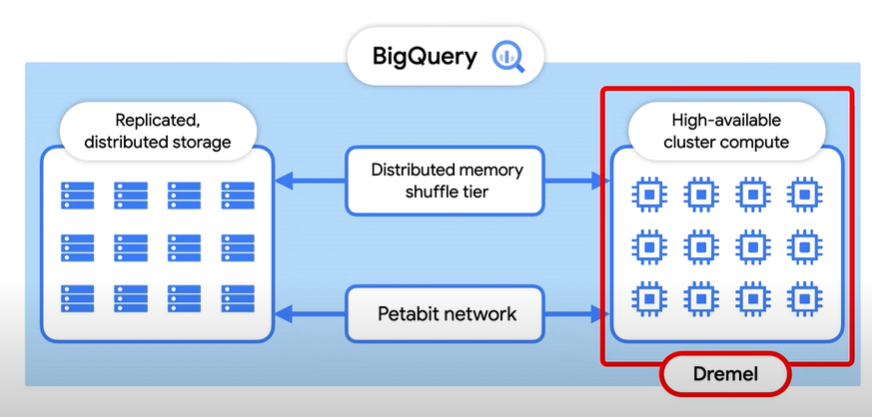
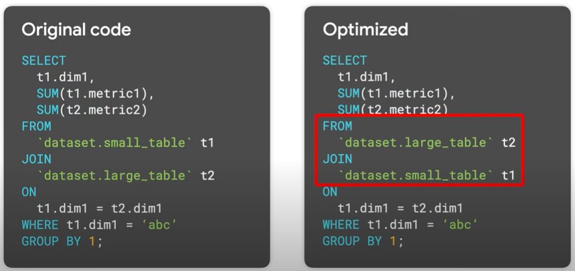

# How to optimize queries in GCP BigQuery?

- __Less work => Faster Query__
- What is work for a query?
    - __Scan__ - How many bytes did you read?
    - __Shuffle__ - How many bytes did you pass to the next stage?
    - __Grouping__ - How many bytes do you pass to each group?
    - __Materialization__ - How many bytes did you write?
    - __CPU work__ - User-defined functions (UDFs) 

## [How does query processing work in BigQuery?](https://youtu.be/q9npE47O2UI?si=TNWYYNzVsEcTdExv)

Computation is done via Dremel. Workers or slots are used to extract data from storage and perform aggregations. To increase the performance each of these slots work independently from one another. Instead of working with each other they use the remote memory shuffle i.e., __Distributed memory shuffle tier__ (as shown in the image below) to store intermediary results. 

In BigQuery, each shuffled row (i.e., the aggregated row) can be consumed by the slot(worker) as soon as its created which makes it possible to operate distributed operations in a pipeline.

All the data movement mentioned above is facilitated by __Jupyter__ (Petabit network, in the image) which is super-fast google scale network.

## [Optimizing BigQuery Queries](https://youtu.be/iz6lxi9BczA?si=y-T2hf4fyTxpTQwm)

#### Do not SELECT unnecessary columns.

As BigQuery storage is columnar its well-optimized for running aggregates but not for returning large amounts of data across rows.

This improves performance by reducing the bytes scanned and the bytes send to subsequent stages.

#### Partitioning and Clustering
Partitions and Clustering helps us to scan only those blocks of data which are needed. So leveraging, Partitioning and Clustering we can prune out the data which is not needed. This includes using __where__ clauses on the partitioning and clustering columns.  Make sure that the order of columns is used correctly so first it will be partitioning column and then clustering columns in the where clause.

Check the table info column:

#### Filter early, filter often
Filter your data as needed earlier to reduce what needs to be passed onto subsequesnt steps.

#### Aggregations
Lets look at how BigQuery executes a GROUPBY clause.

- First data is stored in storage system and GROUP BY done on individual slots. 
- Then results from each slot are bucketed using a Hash function such that the data from same key end up in same slot. This is referred as __shuffling__. 
- So all partial aggregation for the same `title` end up in the same slot. We can see 2nd step happening in the 2nd stage of execution details.

- Further aggregation occurs and final result is passed onto the last slot for which LIMIT limits the results.
- As this requires a few aggregation steps GROUP BY queries can be costly. So, you have to ensure you aggregate and as late as possible.
- So for cases where we have to use sub-queries with aggregation try to move it to as last as possible.

- But an exception if the table size can be reduced drastically by aggregation then do it early.

#### JOINs
If you try to join two large tables then the bigquery favours a __HASH/SHUFFLE join__. 

Similar to aggregation we discussed below, BigQuery uses a Hash function to shuffle(join) a left and right table so that matching key end up on the same slot(worker) and then the data can be joined locally. 

But if one of your tables is small enough to fit in memory then its not necessary to shuffle large amounts of data.

In a small join, known as __Broadcast join__. BigQuery send this small table to every other slot which is processing the larger table.

Now to optimize the join queries:
- Place the larger table first in the join query followed by smaller and then by decreasing sizes.
    

- WHERE clauses should be executed as soon as possible so that slots performing the joins are working with the least amount of data. You also want to make sure that you are using filters on both tables as shown below. This way you ensure that the data you dont need is eliminated from both side of the join. 
    

- Finally, you can cluster our partition table on common join keys because less data is scanned and query will execute faster. And clustering highly improves the efficiency.
    

#### Tweaking the way you do filtering and ordering

- ___WHERE clause:__ Expression order matters! 
- BigQuery assumes that you have used the best order for your filters by default. That is the first part of your where clause must contain the filters that eliminates the most data. 
    

#### Using ORDER BY/RANK

- When you run a __ORDER BY__ statement you might run into resources exceeded error. This is because the final sorting for your query must occur on a single slot.  And if you are attempting to sort on a large result set the final sorting can overwhelm the data. 

- Use of order by / rank increases the computation as the data has to be sorted and then computed and then stored. Its best to do this at the end of query as the operation has to be done on a smaller subset of data and will consume fewer slots. 

- We can also use __LIMIT__ to restrct the number of rows which are taken from each set of slots and improve computation as its done on fewer rows.

---

