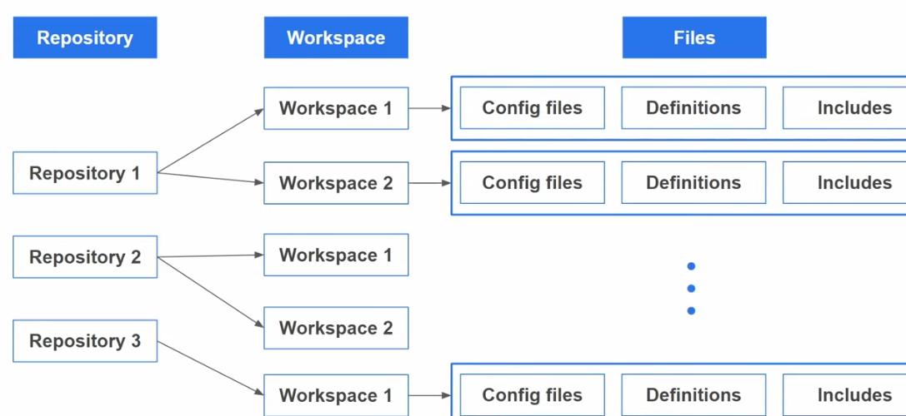
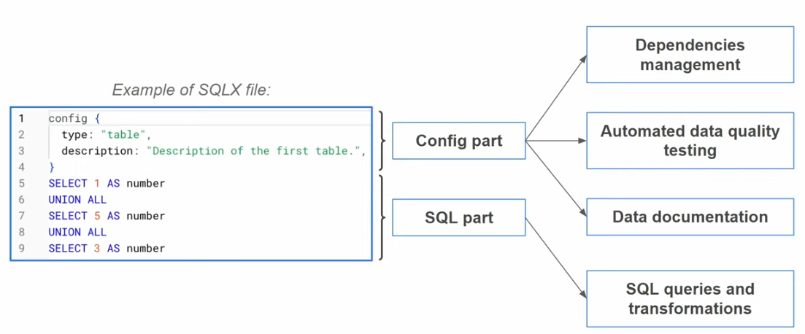
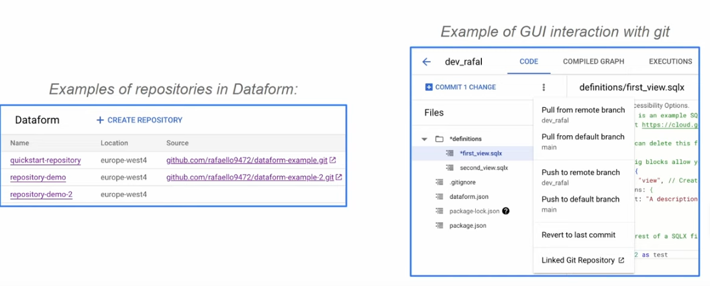
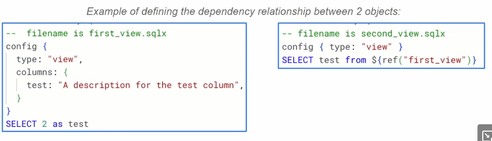
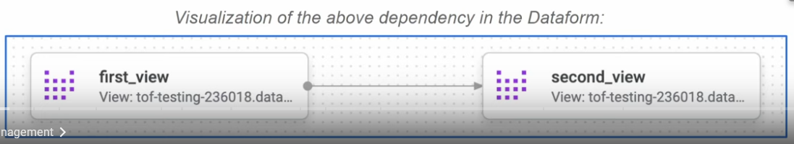
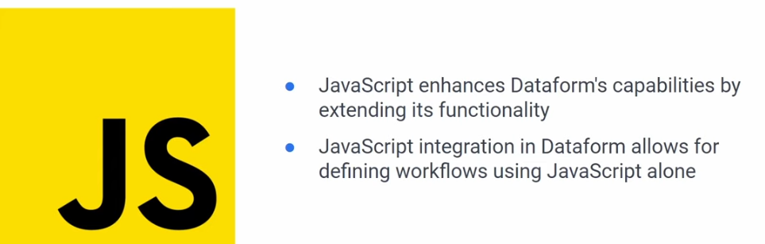
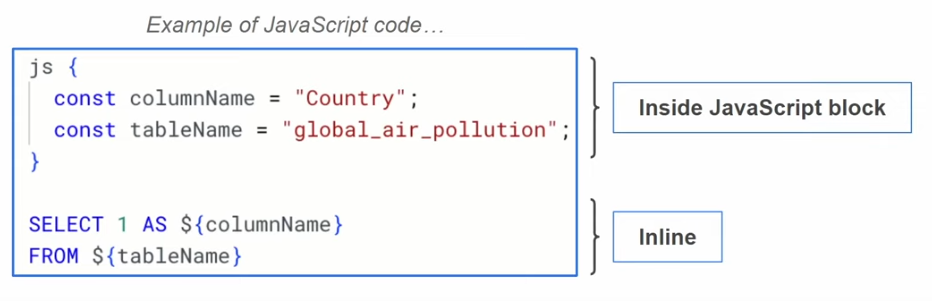
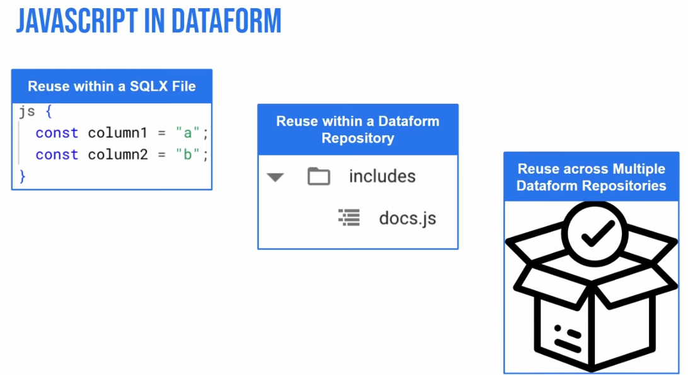

# Introduction to Dataform in GCP

## [What is dataform](https://cloud.google.com/dataform/docs/overview)?

Dataform is a service for data analysts to develop, test, control versions, and deploy/schedule complex workflows for data transformation in BigQuery.

Dataform lets you manage data transformation in the Extraction, Loading, and Transformation (ELT) process for data integration. After raw data is extracted from source systems and loaded into BigQuery, Dataform helps you to transform it into a well-defined, tested, and documented suite of data tables using SQL and JS.

## Key features and Benefits
- Modular data transformations
- Version control and collaboration
- Automated code validation
- Dependency management
- Improved data pipeline and Maintainability
- Accelerated development cycles structred framework and reusable components.

## Key Concepts

- **Repositiry**: Centralized storage location for managing and version controlling code and related assets.
- **Workspace**: It can be compared to a branch in Git as it represents a seperate environment where changes can be made tested independently beore merging them into the main code base.
- **Files**: Each workspace will have its files.

    

    - **config files**: can be config JSON or sqlx files(which leads you to configure your sql workflows, they contain general configuration, execution schedules or schema for creating new tables and views).
    - **definitions**: these are sqlx and JS files that defines tables, views and additional sql operations to run in bigquery. 
    - **includes**: this is where we can define functions and variables to use in your project.

## From SQL to SQLX
SQLX is an open source extension of SQL and the primary tool used in dataform. It brings additional features to SQL which makes develoment faster, scalable and more reliable.

## Version control and collaboration
Dataform uses git for version control and collaboration. Each dataform repository corresponds with a git repository. Once you create a github repository you can connect it to Github repo.

## Dependency Management
Can establish relationship between sql workflow objects such as data sources, tables, assertions and custom SQL operations by declaring dependencies in the SQLX definition file of the dependent object. These dependencies create a dependeny tree that determines the execution order of your SQL workflow object.

## JS in dataform

JS code can be added to SQL file in 2 ways: inline or inside a JS block.

Inline JS allows dynamic modification of SQLX or sql queries while JS blocks allow defining constants, function in SQLX file. We can resuse JS code to streamline development in dataform. Genenrally we have 3 levels of reuse:

## Workflow execution scheduling options
9:53

## Reference:
1. [Introduction to Dataform in Google Cloud Platform](https://www.youtube.com/watch?v=285HnXL9_rk)
2. 