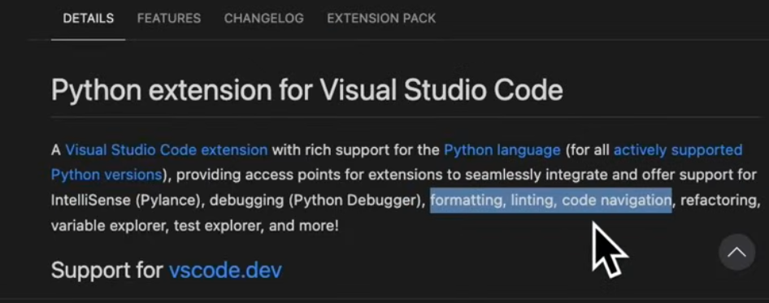
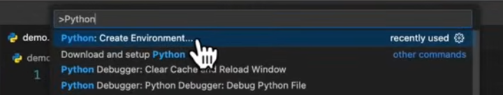
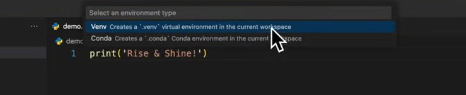
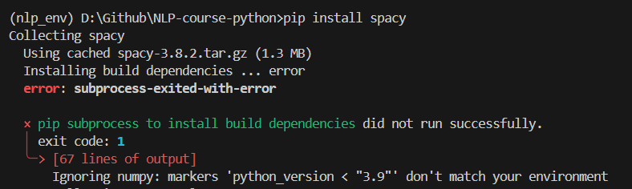

# Learning VS Code

## Setting-up python for use in VS code:

- Step 1: Install python from [www.python.org](https://www.python.org/).
    - Make sure you have checked in the box: _Add Python to path._

- Step 2: Install python extensions in VS Code
    - [Why we need to install python extensions if we have already installed python?](https://youtu.be/D2cwvpJSBX4?t=92)   
    Earlier we installed python interpreter which allows us to execute the python scripts. But for things like linting, code formatting, etc we need python extensions.

    

    Need to search for the following python extensions:
    1. Python
    2. Python Debugger
    3. Pylance


## Setting up a virtual environment

You can set-up a virtual environment in the following ways:
1. Open command prompt and type in the following commands (__myenv__ is the environment name i will be creating here.) 
    ```
    > python -m venv myenv
    > myenv\Scripts\activate
    > pip install pandas matplotlib seaborn scikit-learn
    ```

2. Alternaltively, you can press `ctrl + shift + P`.   
    You can see/search: Python create environment

    

    On clicking it again, it presents us with a list of environment types:
    
    

    You can choose if you want to install using `pip` or `conda`.

    We can then install other packages into the environment by activating that enviroment.

    Sometimes you can get these errors

    

    ```
    pip install spacy --pre
    ```

    If this also doesnt work, then you have to upgrade set-up tools.

    ```
    pip install --upgrade setuptools wheel 
    ```

    Then clear cache:
    ```
    pip cache purge
    ```

    And try to install in isolation:

    ```
    pip install spacy --no-build-isolation
    ```

3. To install using conda environment, you must have anaconda distribution in your system. Go to the location and create environment and activate location.


```
(base) C:\Users\hp>cd /d D:\Github\NLP-course-python
(base) D:\Github\NLP-course-python>conda create --name nlp_env
(base) D:\Github\NLP-course-python>conda activate nlp_env
(nlp_env) D:\Github\NLP-course-python>conda install python
(nlp_env) D:\Github\NLP-course-python>conda install jupyter numpy pandas matplotlib seaborn scikit-learn
(nlp_env) D:\Github\NLP-course-python>conda install nltk spacy keras
```
Was getting the following error:
```
Could not solve for environment specs
The following packages are incompatible
├─ pin-1 is installable and it requires
│  └─ python 3.13.* , which can be installed;
└─ spacy is not installable because there are no viable options
   ├─ spacy [1.9.0|2.0.10|...|2.0.9] would require
   │  └─ python >=2.7,<2.8.0a0 , which conflicts with any installable versions previously reported;
   ├─ spacy [1.9.0|2.0.10|2.0.11|2.0.12|2.0.9] would require
   │  └─ python >=3.5,<3.6.0a0 , which conflicts with any installable versions previously reported;
   ├─ spacy [1.9.0|2.0.10|...|2.3.5] would require
   │  └─ python >=3.6,<3.7.0a0 , which conflicts with any installable versions previously reported;
   ├─ spacy [2.0.11|2.0.12|...|3.3.1] would require
   │  └─ python >=3.7,<3.8.0a0 , which conflicts with any installable versions previously reported;
   ├─ spacy [2.0.16|2.3.1|...|3.7.2] would require
   │  └─ python >=3.8,<3.9.0a0 , which conflicts with any installable versions previously reported;
   ├─ spacy 2.0.5 would require
   │  └─ regex 2017.4.5 , which does not exist (perhaps a missing channel);
   ├─ spacy [2.3.5|3.3.0|...|3.8.2] would require
   │  └─ python >=3.9,<3.10.0a0 , which conflicts with any installable versions previously reported;
   ├─ spacy [3.2.1|3.3.0|...|3.8.2] would require
   │  └─ python >=3.10,<3.11.0a0 , which conflicts with any installable versions previously reported;
   ├─ spacy [3.3.1|3.4.4|3.5.3|3.7.2|3.8.2] would require
   │  └─ python >=3.11,<3.12.0a0 , which conflicts with any installable versions previously reported;
   └─ spacy [3.7.2|3.8.2] would require
      └─ python >=3.12,<3.13.0a0 , which conflicts with any installable versions previously reported.
```

So now I have to downgrade python to 3.12 to install spacy 3.8.2.


Remove the exisitng env and create a new one.

You can get a list of existing Conda environments using the command below:

> conda env list

> conda remove --name ENV_NAME --all

ENV_NAME denotes the name of the environment to be removed/deleted. Make sure you deactivate an environment before removing it by running the conda deactivate command.

The --all flag removes all the packages installed in that environment.

```
(nlp_env) D:\Github\NLP-course-python>conda deactivate
(base) D:\Github\NLP-course-python>conda remove --name nlp_env --all
```

Now creating a new environment: `nlp_env` with python v3.11

```
(base) D:\Github\NLP-course-python>conda create --name nlp_env python=3.11
(base) D:\Github\NLP-course-python>conda activate nlp_env
(nlp_env) D:\Github\NLP-course-python>conda install numpy pandas matplotlib seaborn scikit-learn nltk jupyter keras spacy=3.8.2
```

The easiest way to save the packages from a conda environment to be installed in another computer is:

> (nlp_env) D:\Github\NLP-course-python>conda list -e > requirement.txt


The file __requirement.txt__ will be created in the base folder.
And then you can install the environment using this file in another computer using:

> conda create -n environment_name --file requirement.txt

where __environment_name__ is the name user wants to give to the new environment.


[For ease of use and more collaboration its better to have both environment.yml (for Conda users) and requirements.txt (for pip).](https://stackoverflow.com/a/55687210)

#### environment.yml

This will create __environment.yml__ in the base folder.
> (nlp_env) D:\Github\NLP-course-python>conda env export > environment.yml

So, if say, Adam uses Conda to manage his environments, then all he need to do create his Conda from the environment.yml file:

> conda env create -f environment.yml

In fact, because the environment file created by the conda env export command handles both the environment's pip packages and conda packages, we don't even need to have two distinct processes to create this file. conda env export will export all packages within your environment regardless of the channel they're installed from. It will have a record of this in environment.yml as well.

#### requirements.txt

[requirements.txt for pip](https://stackoverflow.com/a/73253070)


#### Reference: 
1. [Getting Started with Python in VS Code (Official Video)](https://youtu.be/D2cwvpJSBX4?si=UEKzZPuFzDhkxP05)
2. [VS Code set-up for Data and AI projects](https://www.youtube.com/watch?v=mpk4Q5feWaw&t=1798s)
3. [Set up virtualenv using a requirements.txt generated by conda](https://stackoverflow.com/questions/48787250/set-up-virtualenv-using-a-requirements-txt-generated-by-conda)
4. [conda install downgrade python version](https://stackoverflow.com/questions/43630002/conda-install-downgrade-python-version)
5. [Conda Remove Environment – How to Delete an Env](https://www.freecodecamp.org/news/how-to-delete-an-environment-in-conda/)
6. [How to Install Python 3.9 with Conda: A Comprehensive Guide](https://saturncloud.io/blog/how-to-install-python-39-with-conda-a-guide-for-data-scientists/)