# LangChain vs LangGraph vs LangSmith

## [CodeBasics - LangChain vs LangGraph vs LangSmith](https://youtu.be/vJOGC8QJZJQ?si=YZzTcID0ysMKcweI)

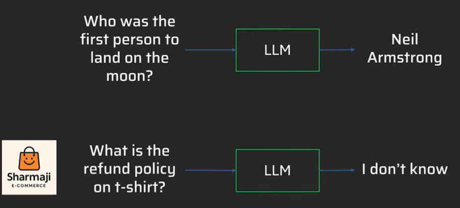

LLM wont be able to answer 2nd question as it doesnt have access to your retail stores policy data. So LLM has access to the org's policy document they can see the details and will be able to anser the queries.

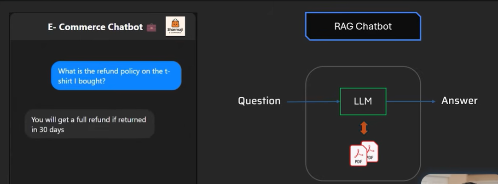

So the steps involved in the backend:
1. Retrieve the documents
2. Splitting the documents into data chuncks to take care of the context window for LLM
3. Store it in vector db for semantic search.
4. Then you retrieve it and call via LLM

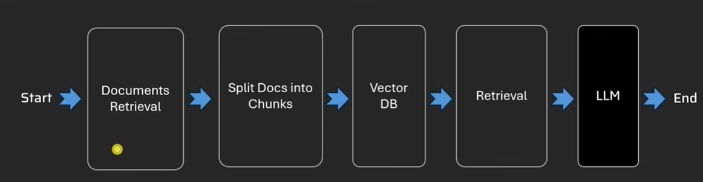

These steps can be done in Python but LangChain does the above steps easier by providing ready made classes.

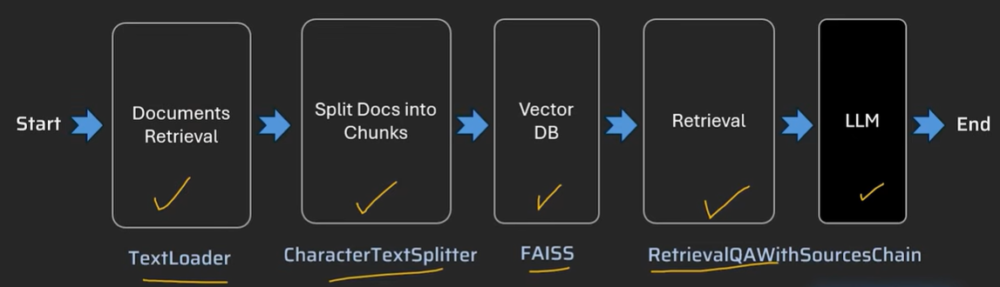

If you categorize LLM powered applications into 2 groups then those 2 groups (as per [Anthropic: Building effective agents](https://www.anthropic.com/engineering/building-effective-agents)) are:
- **Workflows**  are systems where LLMs and tools are orchestrated through predefined code paths. 
  It is basically a software where one of the components is LLM and remaining things are joined by pre-defined core path just like any usual software.
  Lets say using LLM to extract information out of a text in between the workkflow. So, its like a usual software and LLM is one of the components in that ecosystem. This type of thing is called a **chain**. 
    
    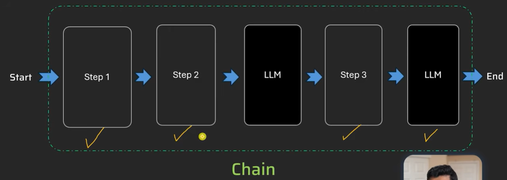

    And **LangChain** is a framework that makes LLM powered applications easy.  Its used mainly to built straight-forward chains and retrieval flows.

    So in the above example its not making any autonomous decisions what it does is that from this text extract this information or summarize this information.

- **Agents** on the other hand, are systems where LLMs dynamically direct their own processes and tool usage, maintaining control over how they accomplish tasks.

    Now lets say you are trying to build a complex chatbot where the customer is asking to replace a shirt with different item. In that case, order ID is needed by the system to verify the purchase, then what item they want to replace it with, price range, etc. So this requires multiple steps and checks with multiple clarifications and policy documents check. Availability of a new item in database check, etc.

    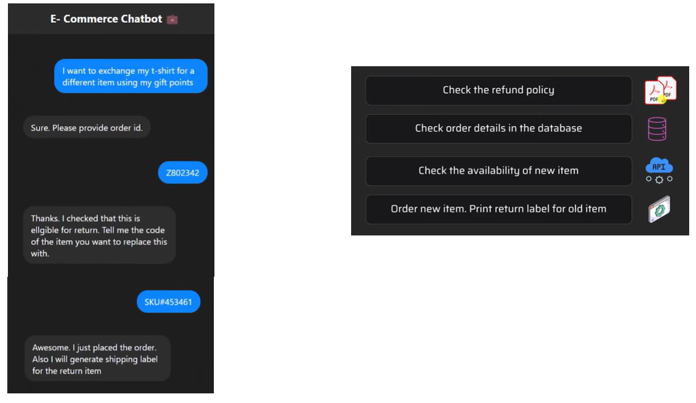

    In each of these steps LLM will be involved. So you are essentiall doing:
    -  **Goal Oriented Planning** for the return of the item the customer has planned.
    -  **Multi-step reasoning**
    -  **Autonomous decision making**
    -  **Tool, knowledge and Memory**

    So you have basically built an agentic chatbot. It will have autonomy and multi-step approach to accomplish a goal.

    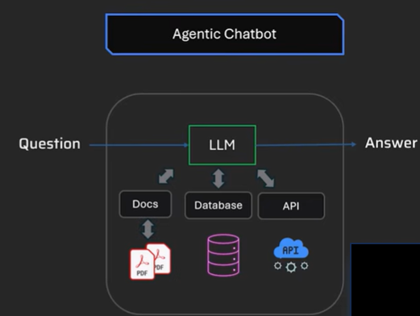

    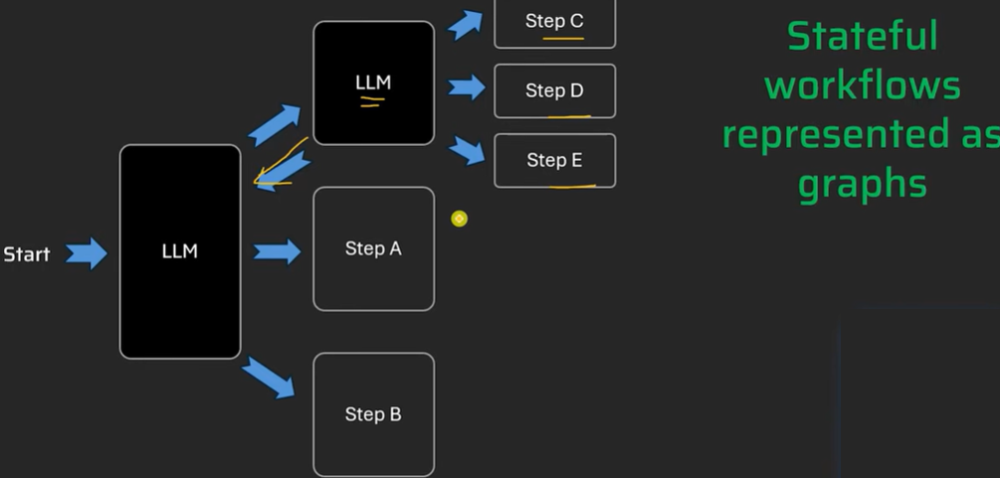

    LangGraph is a framework to orchestrate multi-step, stateful workflows using LLMs with a graph based structure.

### Difference Between LangChain vs LangGraph

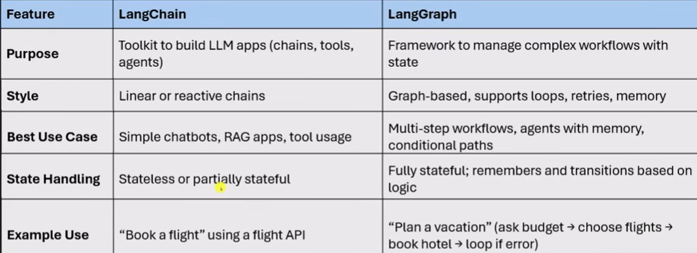

Reactive if you give any input it gives an output.

### LangSmith
LangSmith is a debugging and observability platform for LLM apps.

**Architecture**:
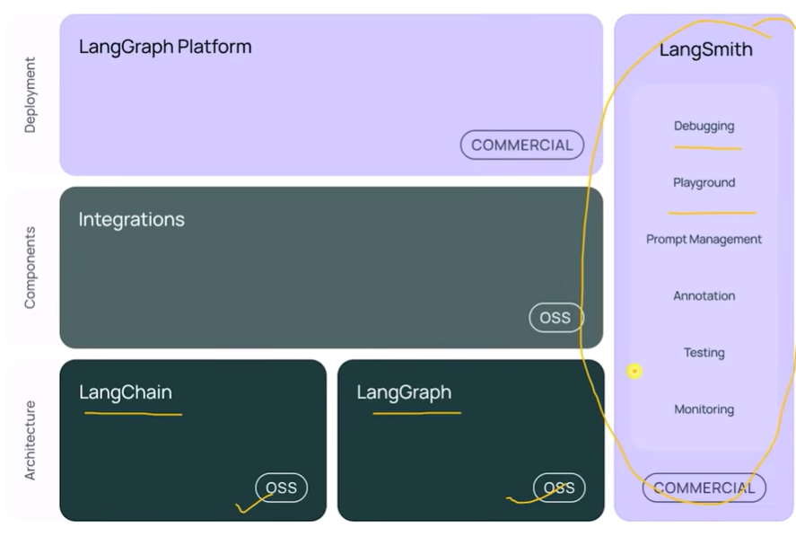

LangSmith does the work of debugging, performance monitoring and token cost. Failures and evalutions checks.

---

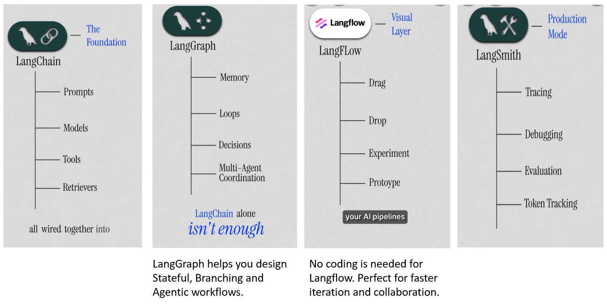

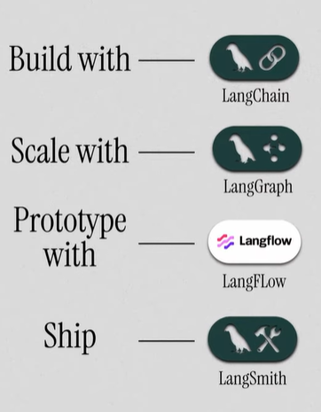

