# Donut chart

Donut chart made in Tableau is an overlap of a pie chart and a circle in the middle. Donut chart being basically a pie chart must not be used to show proportion of more than 4 variables. 

__[Global superstore Data used for this blog can be downloaded from here](https://1drv.ms/x/s!Al_62RL1SdJmiUZ17zQ5m6hokJLu?e=WZciJa)__  

## Type 1: Donut chart which shows the fraction (percentage/ratio) of the whole in each category/dimension.

### Question: Make a donut chart to show percentage of sales of different segments in global superstore.

1. Start by making a pie chart.
	- Drag _Segment_ to the Colour in marks card and then select _Pie_ from the dropdown menu in the marks card.
	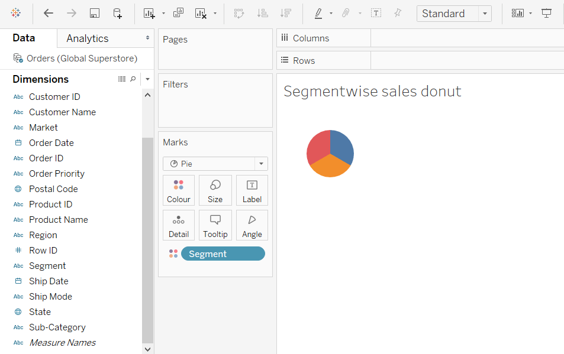

	- And then drag _Sales_ to the newly appeared _Angle_ section in the marks card.
	

	- Now select _Entire View_ in the toolbar above to increase the size of pie chart.
	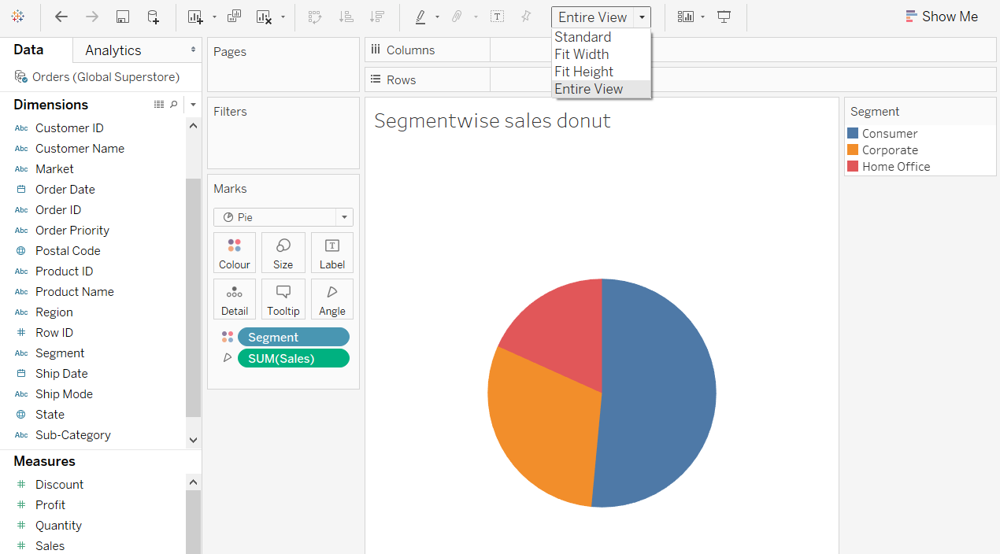

2. To create the inner circle 

	- Create a calculated field named __1__ and having a value `1`. 
	 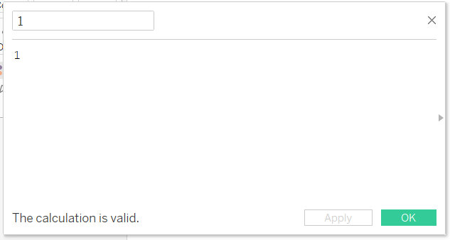

	- Drag the newly created field __1__ to the Rows shelf and change the measure from __sum()__ to __min()__. Then create a duplicate copy of the pill __MIN(1)__ 
	

	- Increase the size of the first pie chart by increasing the size parameter in the marks card of the upper circle.
	

	- Now the lower pie chart must be converted to a circle so remove the dimension segment from the color section of marks card of lower circle. 
	 

3. Overlaying the pie chart and the inner circle

	- Now in the marks card section for the lower circle remove the __angle SUM(Sales)__ pill and convert the axes to dual axis so that the upper and lower circles overlap. Then increase the size of the lower circle so that the overall figure represents a donut.
	 

	- Now change the color of the inner circle to white.
	

	- Now format and remove the lines, axis and headers from the sheet.
	- Now hold ctrl and drag the pills of __Segment__ and __SUM(Sales)__ to the labels' mark card of the upper circle. And do a quick table calculation to get the percentage of sales of the segments involved.
	
	- Now adjust the tooltip of the overall donut chart to remove the _MIN 1_.
	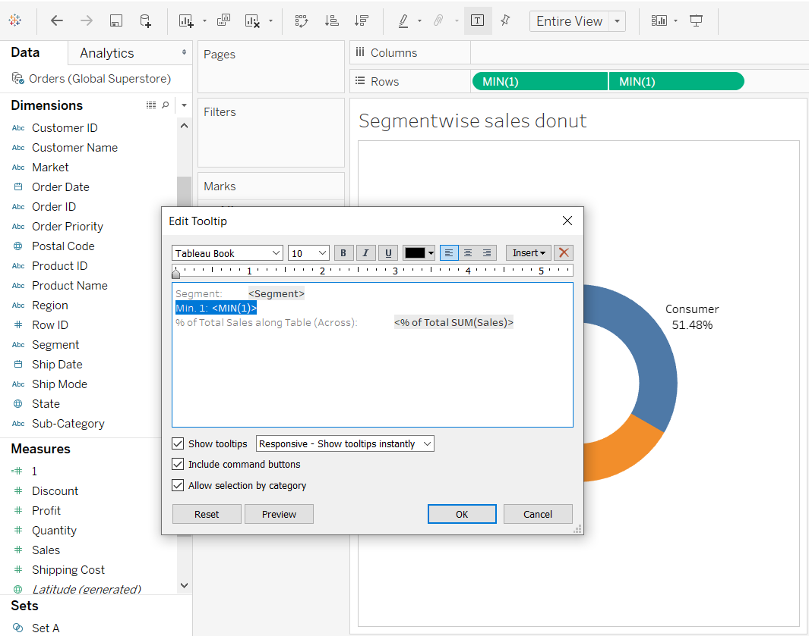

__The resultant donut chart__ - 

***

## Type 2: KPI Donut chart

The best use of donut chart is to show KPIs, according to [Ryan Sleeper](https://evolytics.com/blog/tableau-201-how-to-make-donut-charts/):
> When used for the specific purpose of showing a metric’s progress to goal, with one "slice" being the current state of the KPI and one "slice" being the remainder to goal, I think a donut chart works well. 

A disadvantage of using KPI Donut chart is that it takes up lot of space in the dashboard so the Bullet graph is better alternative. 

### Question: Make a KPI Donut chart to see whether the different regions in USA have reached the target of sales of $800,000.

1. As the dataset has data of only United States, this can be done by filtering using context filter.

2. As the global superstore dataset does not have a goal or target specified so here I will hardcode a target of $800,000 for each region in the US.
And create a calulated field __Left to goal__:

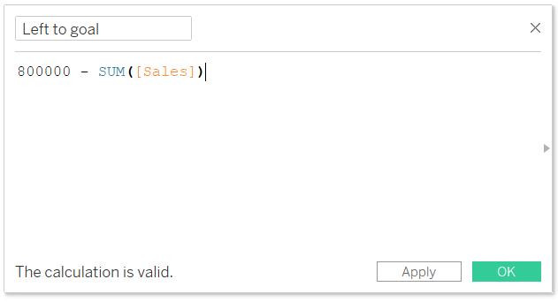

So, the resulting data we will be plotting using KPI Donut chart.

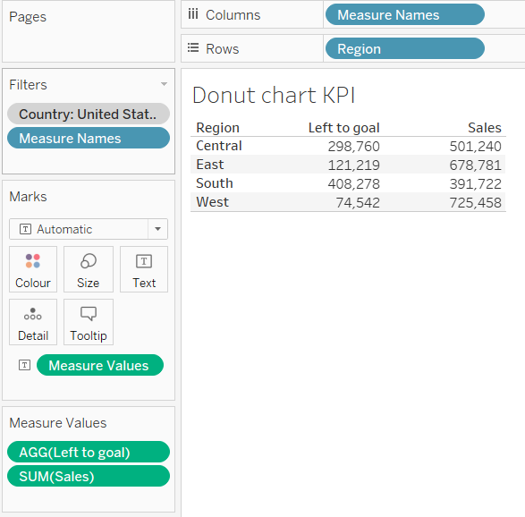

3. Now to create a pie chart using two measures: __Sales__ and the newly created __Left to goal__. Select pie chart in the dropdown of marks card and drag __Measure Name__ dimension to the Colour Marks card and __Measure Values__ to the Angle marks card. Then filter the view on __Measure Names__ to only include __Sales__ and __Left to goal__. 
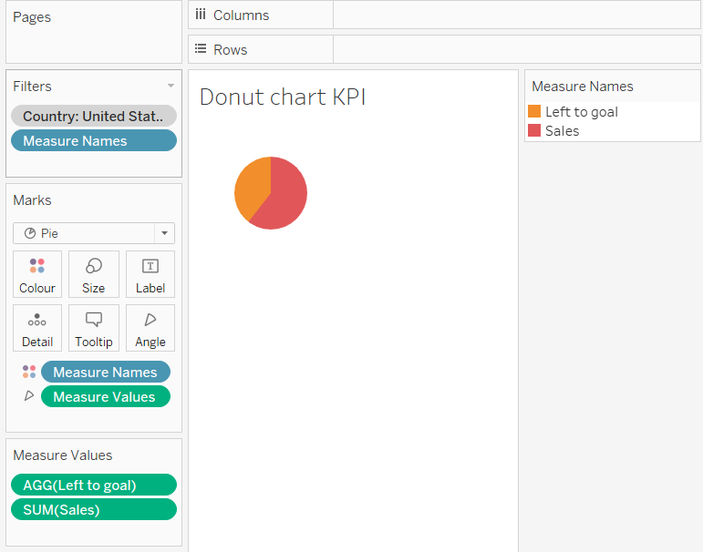

4. Drag the calculated field __1__ measure to the Rows shelf and change the aggregation to minimum. Duplicate the pill __MIN(1)__ on the rows shelf and then right-click on the second pill and choose "Dual Axis". Then synchronize the axes.
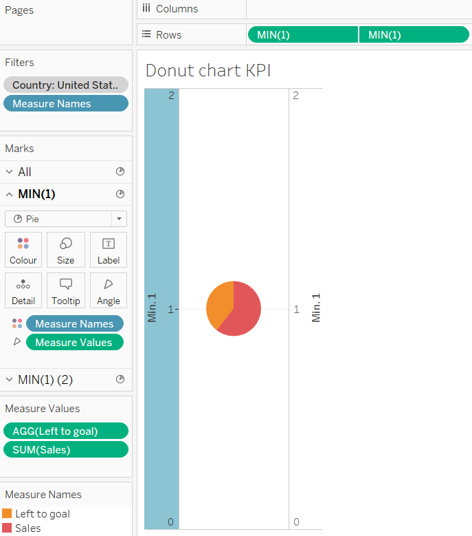

5. Format the sheet to remove axes, headers and zero line.
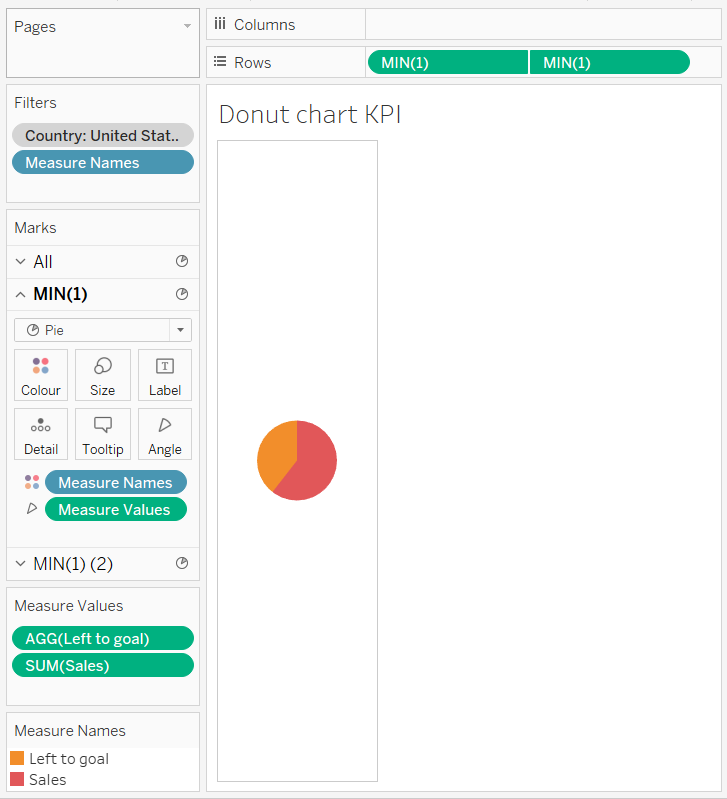

6. Format the primary axis to increase the size of the pie chart, adding a border and most importantly: coloring the __Sales__ measure to a color of your choice (say, blue) and the __Left to goal__ to measure grey. This will eventually create the filling gauge effect in KPI we are going for.
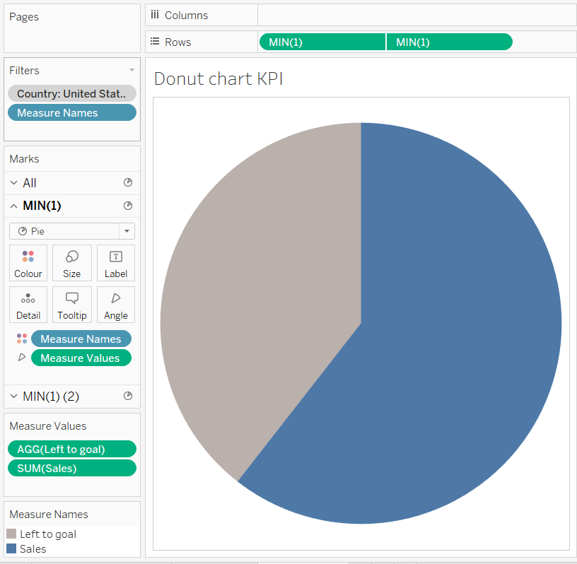

7. Now to create a hole in the pie chart formed above use secondary axis. Remove __Measure Name__ and __Measure axis__ and change its color to white. 

8. Now add dimension __Region__ to the columns shelf and drag it to the labels of the primary axis and set its alignment to top and make the labels as bold.
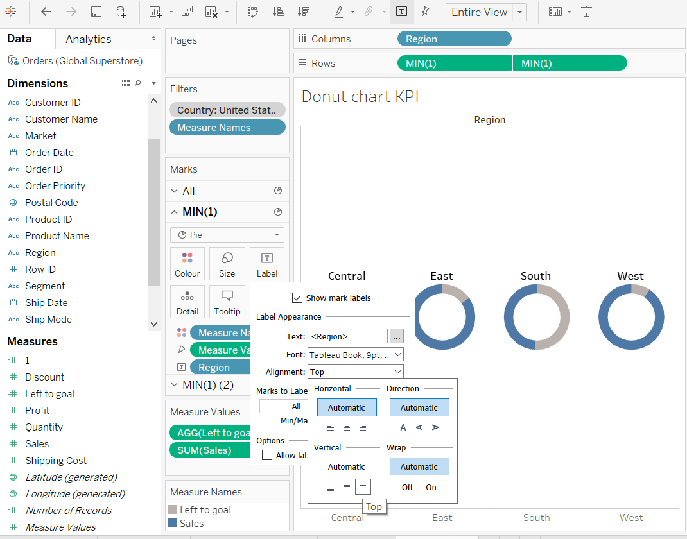

9. Create a calculated field named __KPI goal %ge__ to find the percentage of sales target achieved and then format it to percentage and to 2 decimal places.
And then modify the label in the secondary axis to show the KPI
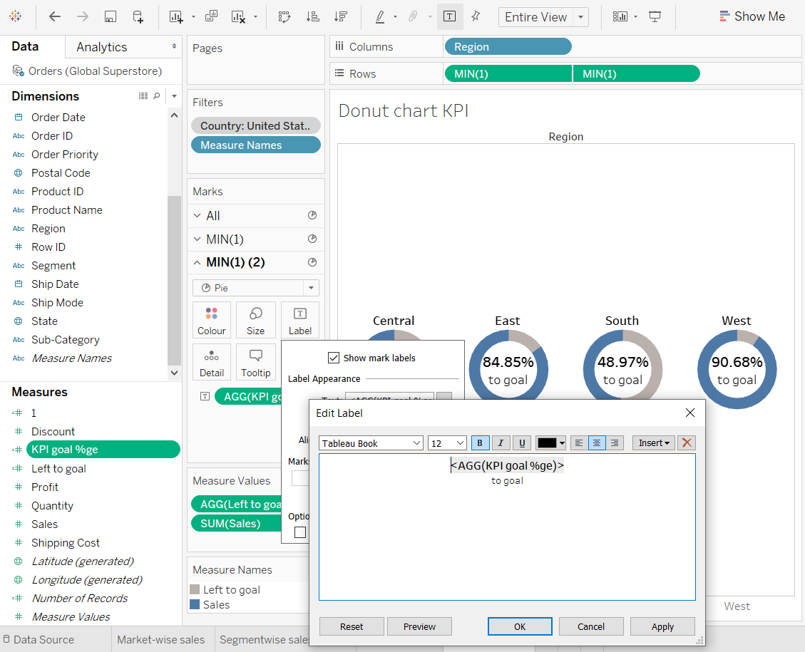

10. Sort __Region__ in the column shelves by the % to goal metric in descending order.
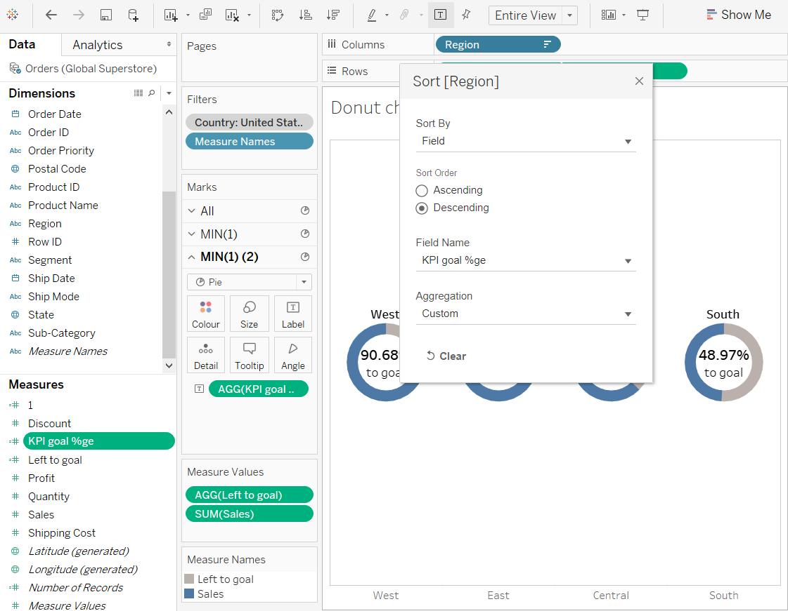
 
11. Resultant KPI donut chart.
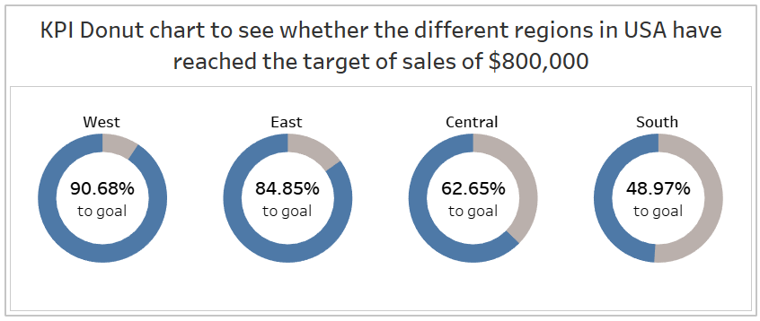

## [Click here to see the resultant donut charts dashboard](https://public.tableau.com/views/Donutchart_15844398959790/Dashboard3?:display_count=y&publish=yes&:origin=viz_share_link)

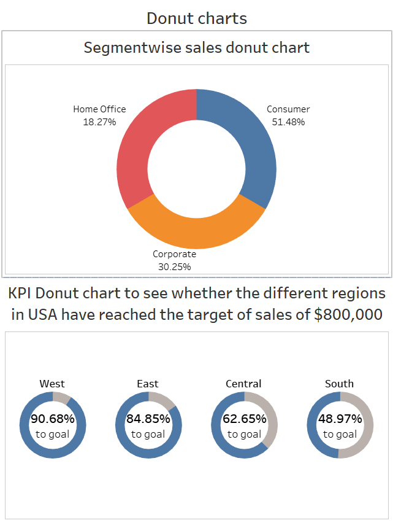

***
## Reference:
1. [Tableau Tip: How to make KPI donut charts](http://www.vizwiz.com/2014/12/donutcharts.html)
2. [Tableau 201: How to Make Donut Charts](https://evolytics.com/blog/tableau-201-how-to-make-donut-charts/)
