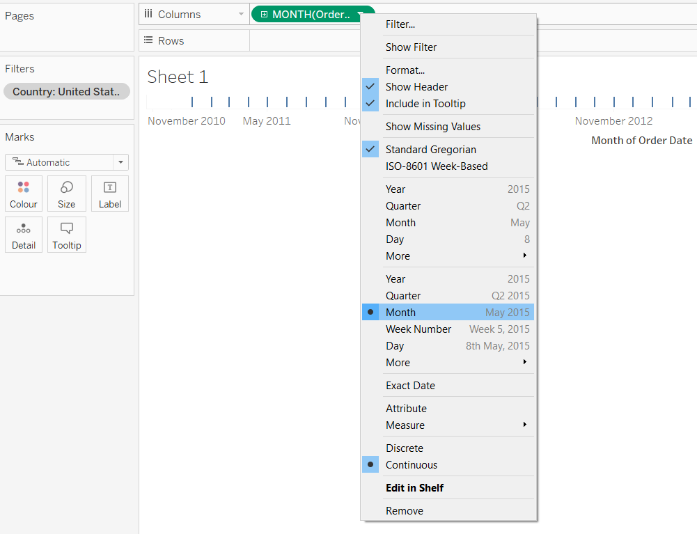
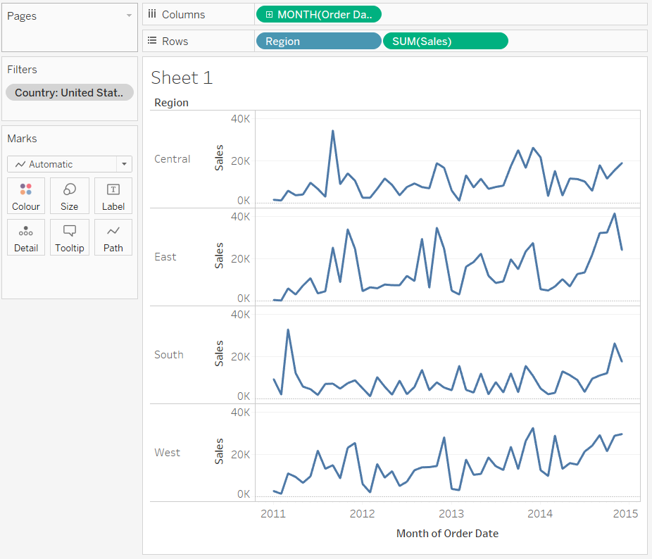
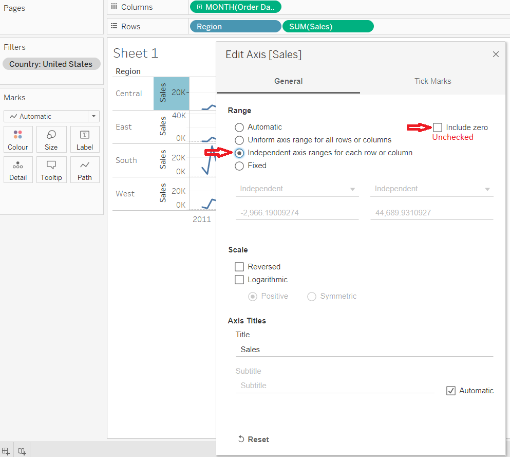
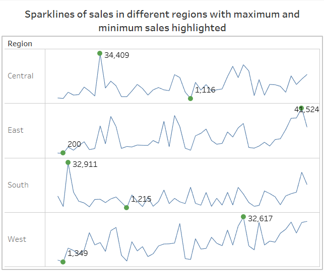

# Sparklines

Sparklines can be used to show the variation of a variable or its trend over time. In other words, it is mostly used to represent the time-series data. They are line charts but without the x-axis and y-axis and their corresponding values. They are made to fit in a small area of the dashboard and can give information on the trend of a measure for different members of a dimension.

## Steps to create sparklines in Tableau with the minimum and maximum points highlighted

For this I have used the [global superstore orders data](https://www.dropbox.com/s/ypodk3kminqa7il/Global%20Superstore.xls?dl=1). I will be creating a sparkline to show the variation or trend of sales in different regions of the USA. So add a context filter to filter out USA's data in the given superstore data.

1. First drag and drop the Order Date variable to the column shelf.
2. Then right click the __Order Date__ pill and select the __Month (May 2015)__ so that the variable is changed to continuous format (pill will become green).
   

3. Then drag the dimension __region__ and measure __sales__ to the row shelf. The resulting image will be like this:  
   

4. Now resize the sheet such that the whole chart comes up in a compact area and the trends are clearly visible.
    

5. Now right click on the __Sales axis__ and in the new menu click on __edit axis__:
	- Uncheck __Include zero__
	- And check __Independent axis or range for each range or column__
	

6. Now create a calculated field-  __Min or Max points__: 
   ```
	// For each region and month, calculate the sum of sales. Then for each region calculate the maximum
	IF SUM({ FIXED [Region]: MAX({FIXED [Region], DATETRUNC('month',[Order Date]) : SUM([Sales])})}) 
	= SUM([Sales])
	THEN SUM([Sales])
	// For each region and month, calculate the sum of sales. Then for each region calculate the minimum
	ELSEIF 
	SUM({ FIXED [Region]: MIN({FIXED [Region], DATETRUNC('month',[Order Date]) : SUM([Sales])})}) 
	= SUM([Sales])
	THEN SUM([Sales])
	END

   ```	

7. Add the calculated field so as to form a dual axis and synchronize it with the main axis. Also right click on nulls and click hide indicators and uncheck Header. Now we can see the minimum and maximum points on the sparklines. (Though the color of the lines and points may vary)
  

8.	Now right click on the __Sales, Min or Max Points__ and __Month of Order Date__ axis and uncheck the headers for __Sales, Min or Max Points and Month of Order Date__.

9. Now right click on the axis for region and click format and then remove the Grid lines, zero lines, ref lines and borders.

10. Now we can reduce the thickness of sparklines by modifying the size of the marks card for sales and then we can increase the size of points which denote the maximum and minimum point by selecting circle in the dropdown menu of __AGG(Min or Max points)__ and increasing circle/point size.

11. Now to label the maximum and minimum point on the sparklines - drag the  __Min or Max Points__ to the labels of the __AGG(Min or Max points)__ marks card.

12. [The resultant dashboard](https://public.tableau.com/views/Sparklinesofsalesindifferentregionofglobalsuperstore/Dashboard1?:display_count=y&publish=yes&:origin=viz_share_link):
    

***


