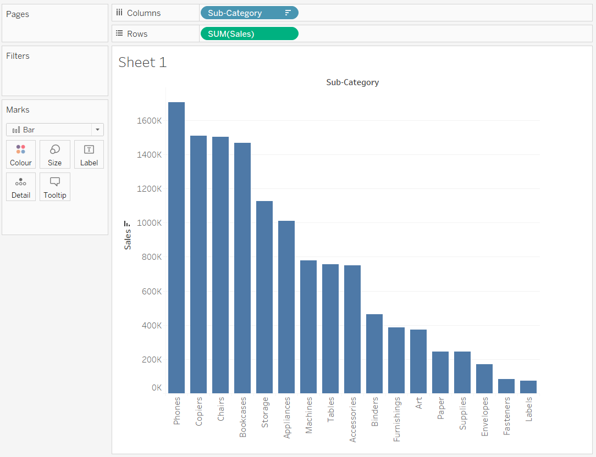
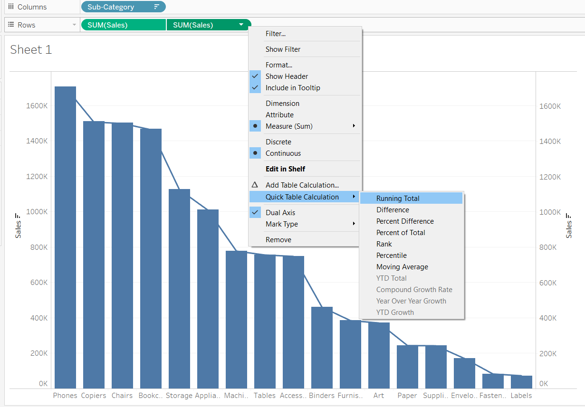
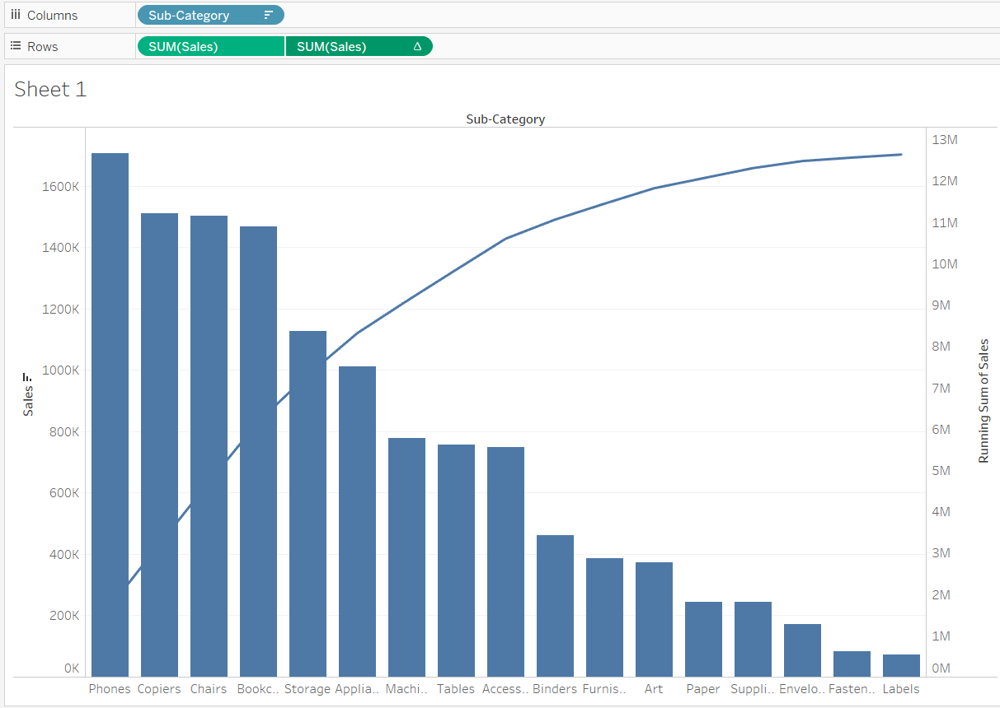
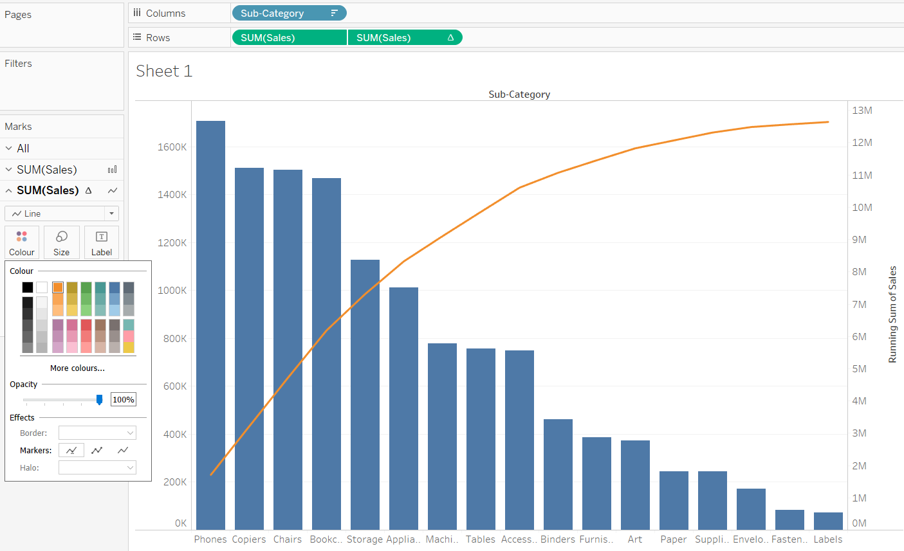
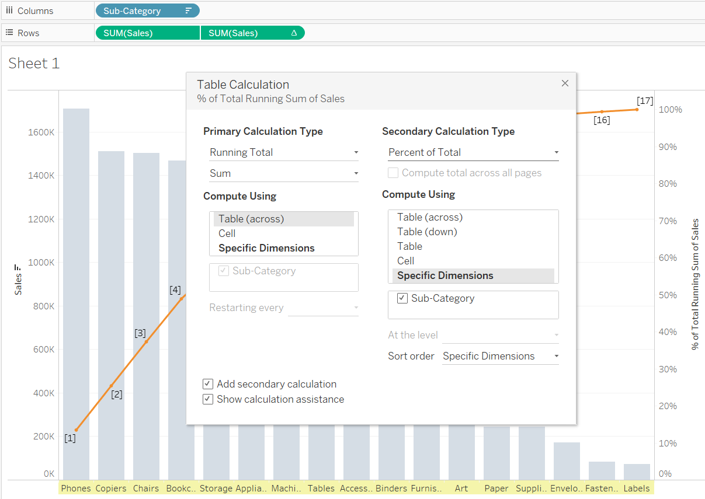
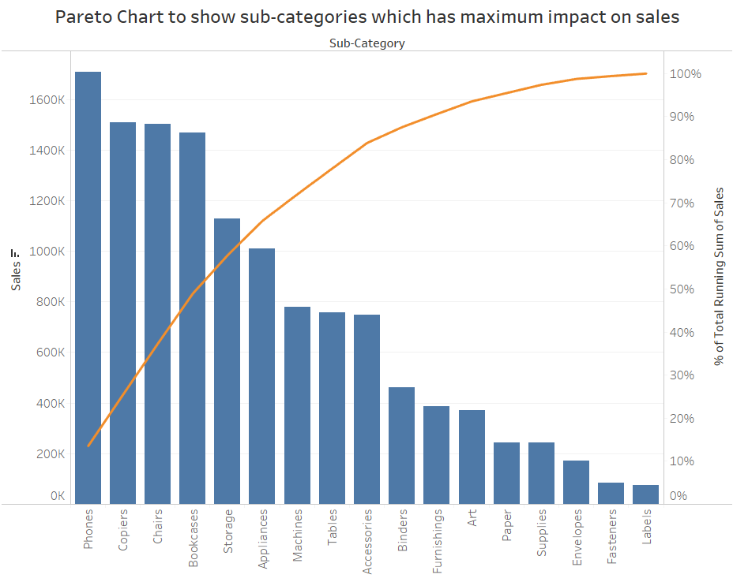

# Pareto Chart

A Pareto Chart is a dual-axis combination chart used to highlight dimension members that are having the biggest impact to the measure in question.
On the primary axis, bars are used to show the raw quantities (of measure) for each dimension member, sorted in descending order. On the secondary axis, a line graph is used to show the cumulative total of measure(or in the percent format). 

It is basically based on the theory of __80-20__ phenomena, where it means that 80% of the output is being generated by the 20% of the input. 

## Application
- In quality control, it often represents the most common sources of defects, the highest occurring type of defect, or the most frequent reasons for customer complaints. 
- In terms of retail data, we can also say like this that 80% of revenue is from 20% of customers/products. 

## Steps to make chart

__[Click here to download the Global superstore orders Data used here](https://www.dropbox.com/s/ypodk3kminqa7il/Global%20Superstore.xls?dl=1)__  

Load the Orders data to Tableau.

1. Drag the __Sub-category__ on the columns shelf and __Sales__ on the y-axis and then arrange the __Sub-Category__ in descending order. 
   

2. Next, hold ctrl and create copy of pill `SUM(Sales)` in the Rows shelf itself. Then right click on the 2nd newly formed `SUM(Sales)` and create a dual axis. Then change the Mark Type of the second chart to Line:
      

3. Now to get the cumulative total on the right (secondary) axis do a quick table calculation of _running_total_.
    

4. The resulatant image with cumulative total on the secondary axis with the modified line chart.
   

5. Click on the __Color marks card__, to change the color of the line and the Pareto chart is completed.
   

6. Now to change the cumulative total on the secondary axis in terms of percentage use secondary table calculation. Right click on the second pill `SUM(Sales)`   and check `Add Secondary Calculation` and secondary calculation tyoe as __Percent of Total__. 
   

7. The resulatant image:
   

Insights obtained from the above chart - close to 60% of the sales is caused by 5 sub-categories: Phones, Copiers, Chairs, Bookcases and Storage.

### Reference:
1. [A Step-by-Step Guide to learn Advanced Tableau – for Data Science and Business Intelligence Professionals](https://www.analyticsvidhya.com/blog/2018/03/tableau-for-advanced-users-easy-expertise-in-data-visualisation/)
2. [Pareto Chart in Tableau](https://www.absentdata.com/tableau/pareto-chart-in-tableau/)
3. [Tableau 201: How to Make a Pareto Chart](https://evolytics.com/blog/tableau-201-make-pareto-chart/)

