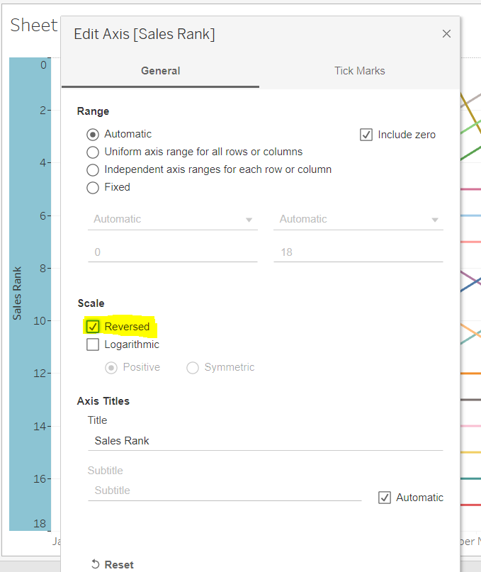
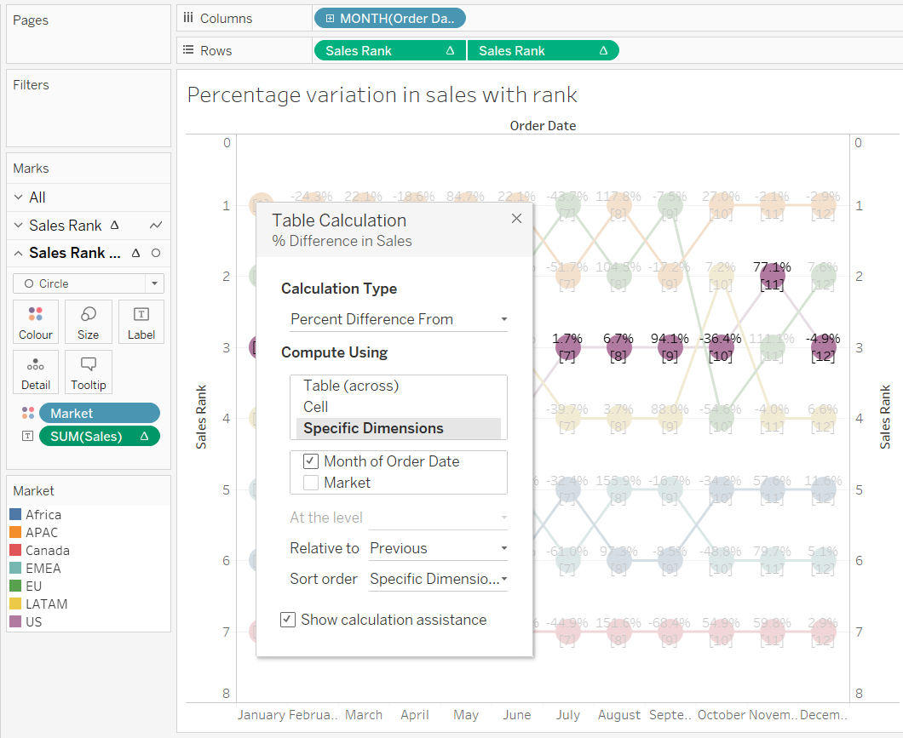

# Bump Chart

Bump charts are used to show how dimension members are ranked across different measures over time. They are very useful for exploring the changes in Rank of a value over a time dimension or place dimension or some other dimension relevant to the analysis.

The Bump Chart takes two dimensions with zero or more measures.

The bump chart is actually an overlay of two different charts using the dual axis function, one outputs lines and another outputs circles. Both are generated from the ranking we choose to visualize.

Applications of Bump chart to see:
- How specific product categories have ranked in sales for your company from year to year?
- How rankings for product categories change based on seasonality (can use discrete months)?
- How fantasy football players are ranked across different statistics from week to week?

__[Global superstore orders Data used for this blog can be downloaded from here](https://www.dropbox.com/s/ypodk3kminqa7il/Global%20Superstore.xls?dl=1)__  

###  How sales of sub-categories rank between January and December

1. As we need sales by months (i.e., discrete) so we will drag `Order Date` to columns and right click and select __discrete MONTH(Order Date)__. 
  

2. Create a calculated field called __Sales Rank__ with query `RANK(SUM(Sales))`.
3. Now drag and drop the field __Sales Rank__ to the Rows shelf and we get the following line chart.
   

4. To rank the sales amounts by the __Sub-category__ dimension, make the level of detail in the view more granular by dragging the  __Sub-category__ dimension to the Color Marks Card.
   

5. The rank in the field is calculated using table calculation (table across) as we need to do our calculation based on sub-category. So right click on the pill __Sales Rank__ and select _Compute using  Sub-Category_ to compute table calculation based on __Sub-category__.  
  

6. Now right click on the axis and select edit axis and reverse the axis to get the best rank (i.e, 1) on top of the view.
  

7. Now to overlay circles on top of the lines to show the rank obtained by each sub-category. Create a dual-axis by duplicating the pill __Sales Rank__ on the Rows shelf and then right click on the new pill __Sales rank__ and  click Dual axis and then Synchronise. 

8. Now select circle in the dropdown menu of the secondary axis marks card and adjust its size.
 

9. Now to show the variation of Sales Rank by months: Hold control and drag and drop __Sales rank__ pill to labels mark card of secondary axis and adjust alignment accordingly to get the rank inside the circle.
 

10. Now the resultant image obtained: 
 

### Variation of Sales in different market between January and December using sales ranking and Percentage variation in sales

1. Use __Market__ instead of __Sub-Category__ and repeat the steps from 1 to 9 and we will get the following:
  

2. Remove the __Sales Rank__ pill from the secondary axis pill and drag _Sales_ instead to label and do a table calculation for percentage difference.
 

3. And the resultant image with both rank and percentage variation in sales- 
 

### Variation of Sales between January and december for various dimensions - __Segments__, __Region__, __Category__, __Market__, __Sub-category__ and __Order Priority__.

1. Create a string parameter with choices of the follwoing dimensions: __Segments__, __Region__, __Category__, __Market__, __Ship Mode__, __Sub-category__ and __Order Priority__.

 

2. Now create a calculated field __Select Dimension__  to give Tableau instructions on what to display for each parameter choice.

```
CASE [Choose Dimension]
WHEN "Segment" then [Segment]
WHEN "Region" then [Region]
WHEN "Market" THEN [Market]
WHEN "Category" THEN [Category]
WHEN "Sub_Category" THEN [Sub-Category]
WHEN "Order Priority" THEN [Order Priority]
WHEN "Ship Mode" THEN [Ship Mode]
END
```

3. Now replace the dimension __Market__ from the color Marks card with the calculated field dimension __Select Dimension__ and change the table calculation's computation using __Select Dimension__.

4. Now right click on the Parameter __Choose Dimension__ and select __Show Parameter Control__.

5. Now if I choose _Category_ in the Parameter control my Bump Chart will be based on the __Category__ dimension.

 

6. Now if I choose _Market_ in the Parameter control my Bump Chart will be based on the __Market__ dimension.

 

We can also use measures in the Parameter control here instead of dimension.


Made story of these vizs - [Link of the story in Tableau public](https://public.tableau.com/shared/5535BMKNQ?:display_count=y&:origin=viz_share_link).

## Reference:

1. [Tableau 201: How to Make Dynamic Dual-Axis Bump Charts](https://playfairdata.com/tableau-201-make-dynamic-dual-axis-bump-charts/)
2. [How to Let Users Choose Measures and Dimensions in Tableau](https://playfairdata.com/how-to-let-users-choose-measures-and-dimensions-in-tableau/)
3. []()