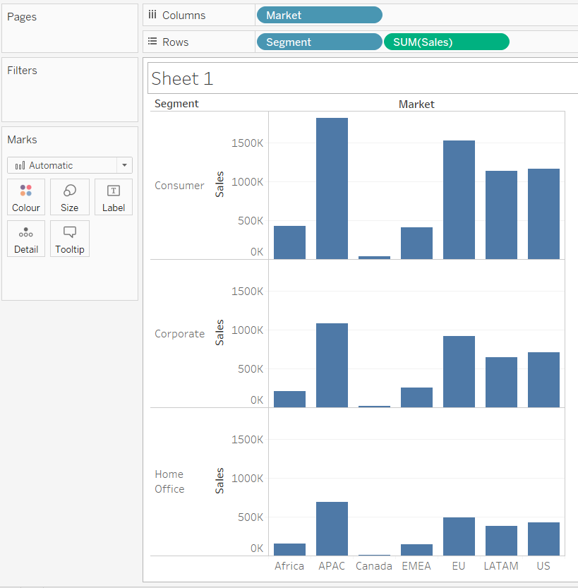
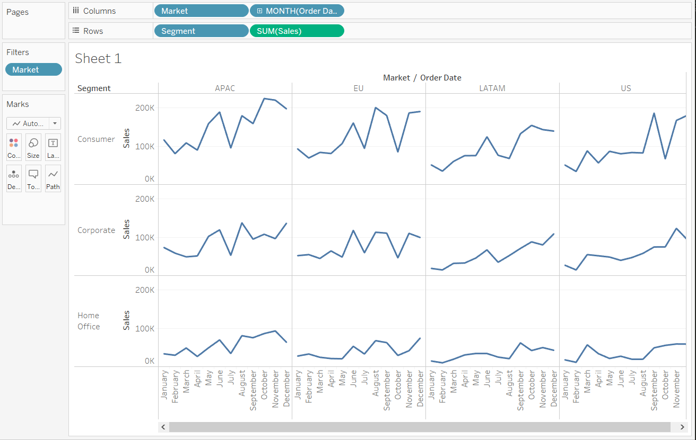
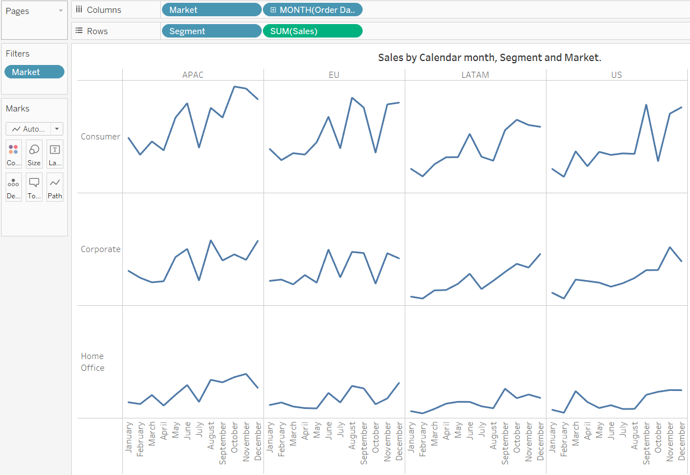

# Making small multiple charts in tableau

Small multiples are a group of charts or graphs that share the same axes and scales, which allows the user to compare trends across dimensions in a single view. They have been praised for their ability to provide a great deal of context, reducing the need for end users to ask the dreaded, __….So what?__. 

> While small multiples is still a ‘descriptive’ view, it helps answer the question, __"Compared to what?"__

## Case 1: Comparing a single measure across two different dimensions.

__[Global superstore orders Data used can be downloaded from here](https://www.dropbox.com/s/ypodk3kminqa7il/Global%20Superstore.xls?dl=1)__  

Here comparing measure __Sales__ across two dimensions - __Market__ and __Segment__. 

### Steps:

1. Place one dimension __Market__ on the columns shelf and other dimension __Segment__ on the Rows shelf along with the aggregation `SUM(Sales)`. 
  
  Small multiples may be a series of bar charts, but we still need to add an element of time to trend the ‘Sales’ measure.

2. For ease, here I will be filtering and using only four markets - EU, APAC, US and LATAM. Now place a date field __Order Date__ on the 'Columns' shelf.
  
   It can be used to evaluate the seasonality of sales to answer question such as, "Is there a certain month that I can expect a spike in sales?" Then right click and change __YEAR(Order Date)__ to __MONTH(Order Date)__. We will obtain the Dates as monthly data, now right click on the Dates label on the x-axis and choose __Rotate Label__ to rotate and view months clearly.
   

3. Now do the necessary formatting to finalize a view.
   - Hid the field labels for columns by right-clicking on "Market / Order Date".
   - Hid the field labels for rows by right-clicking on “Customer Segment”.
   - Right click on the row axis and click on Sales and uncheck _Show Header_.
   - To keep the view as clean as possible, its better to provide context in the form of a title, and would typically provide additional information in the tooltips that appear when an end user hovers over different data points. 

   The resulting image:
   

[Link to the small multiple image](https://public.tableau.com/profile/jeswin.george#!/vizhome/SmallMultiplesChart-SalesbyMonthsSegmentandMarket/Dashboard1?publish=yes)

### reference:
1. [Tableau 201: How to Make Small Multiples](https://evolytics.com/blog/tableau-201-how-to-make-small-multiples/)
2. [How to Make Trellis / Tile / Small Multiple Maps in Tableau](https://playfairdata.com/how-to-make-trellis-tile-small-multiple-maps-in-tableau/)
3. [How to Make Small Multiple Maps in Tableau](https://dataremixed.com/2014/09/how-to-make-small-multiple-maps-in-tableau/)
