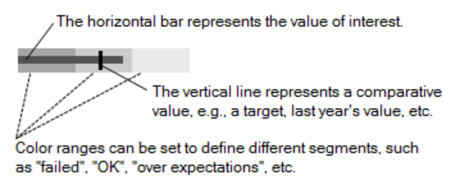
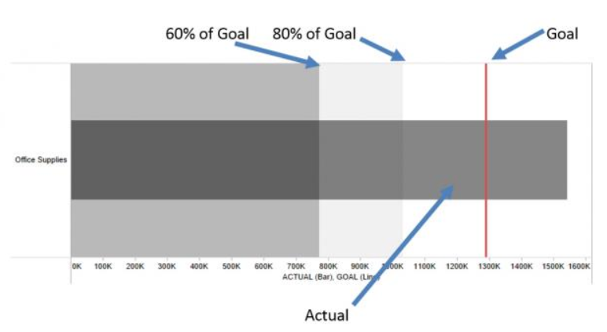
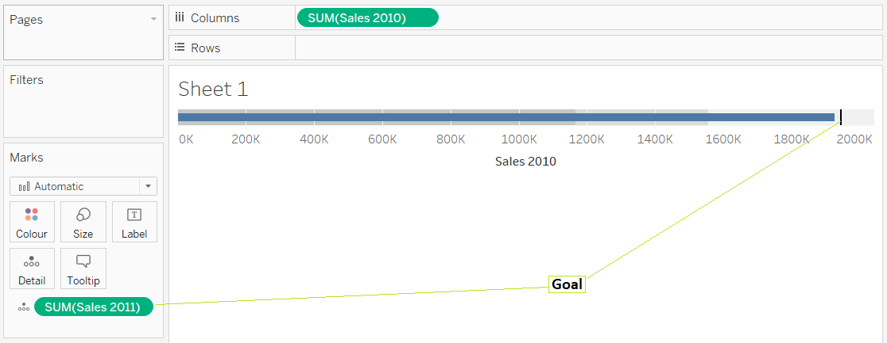
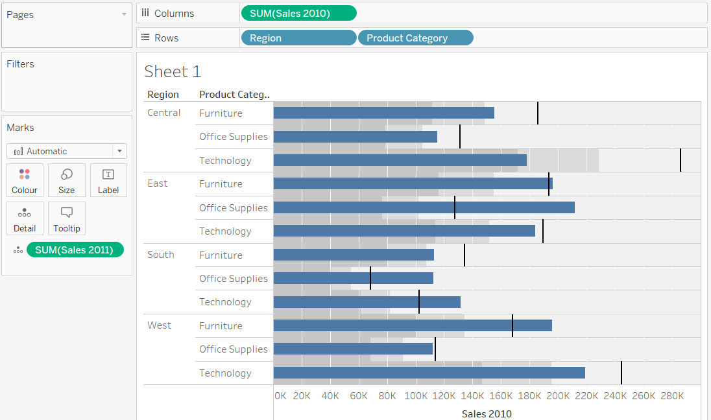
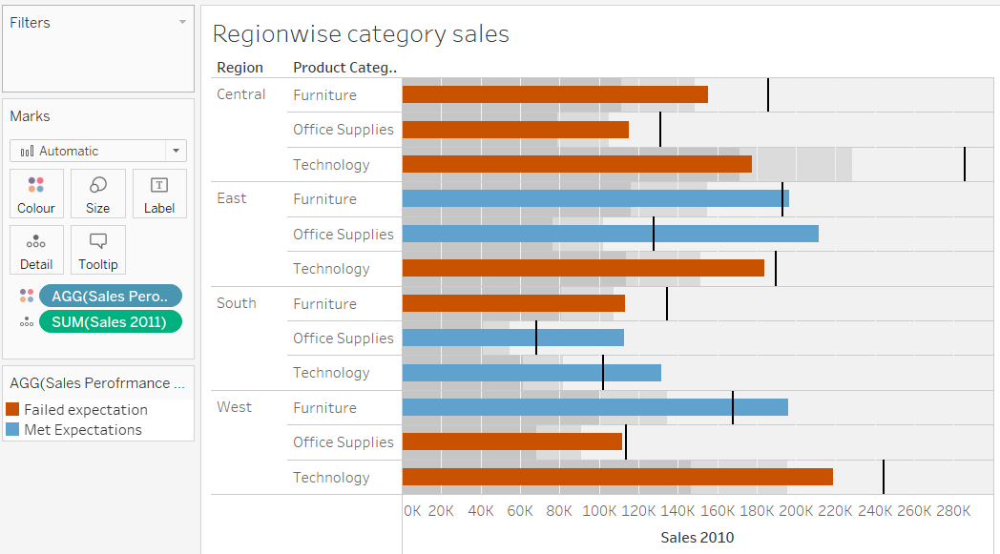

# Bullet graph

Bullet graphs are used to compare one value, represented by a horizontal bar, to another value, represented by a vertical line, and relate those to qualitative ranges.



A bullet graph is a very powerful way to compare data against historical performance or pre-assigned thresholds. As you’ll see, we can include a lot of information in a small space with this type of chart that is also Tableau’s answer to those looking for a gauge or meter visualization. 

Here are the different components of a mark within a bullet graph:



> In the image above, the dark gray bar represents actual performance while the red reference line is a goal. The underlying distribution range has been set to identify 60% and 80% goal completion. The example above shows that the current revenue is well above the reference line goal, indicating that this year’s performance was stronger than the previous one.


Steps:

[Download dataset used here](https://www.dropbox.com/s/qmn7q50r6d4i4bc/superstore_sample.xlsx?dl=0)

Lets try to compare the total sales made during the year 2010 and 2011.

1. Create 2 measures to get the total sales made during the years 2010 and 2011.
   Create calculated field - __Sales 2010__
   ```
   IF YEAR([Order Date])=2010
   THEN [Sales] ELSE 0 END
   ```

   Create calculated field - __Sales 2011__
   ```
   IF YEAR([Order Date])=2011
   THEN [Sales] ELSE 0 END
   ```

2. Then hold shift and select the new measures __Sales 2010__ and __Sales 2011__ and from the Show Me section select Bullet Graph. And the resultant image is:



3. We can increase granularity by adding 2 more dimensions to it.



4. Now can create a calculated field to see if the Sales made in 2010 were greater than the Sales in 2011 for the given dimensions. Create calculated field - __Sales Performace 2010__:
```
IF SUM([Sales 2010]) > SUM([Sales 2011]) 
THEN 'Met Expectations' ELSE 'Failed expectation' END
```
Then drag it to colors mark card and we get the following image.




Reference:

1. [Tableau Essentials: Chart Types – Bullet Graph](https://interworks.com/blog/ccapitula/2014/12/29/tableau-essentials-chart-types-bullet-graph)
2. [Build a Bullet Graph](https://help.tableau.com/current/pro/desktop/en-us/qs_bullet_graphs.htm)
3. [Tableau 201: How to Make Bullet Graphs](https://evolytics.com/blog/tableau-201-how-to-make-bullet-graphs/)