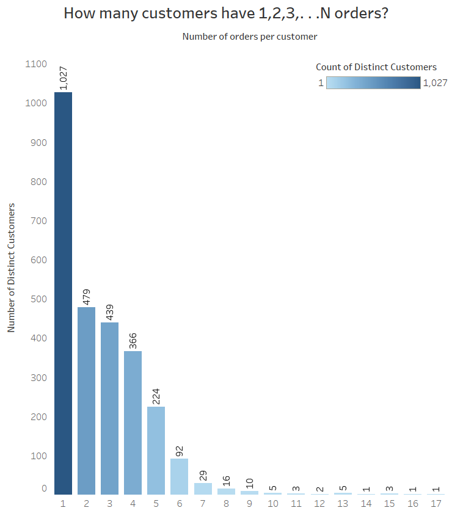
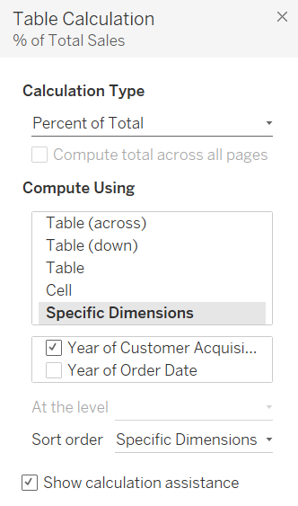
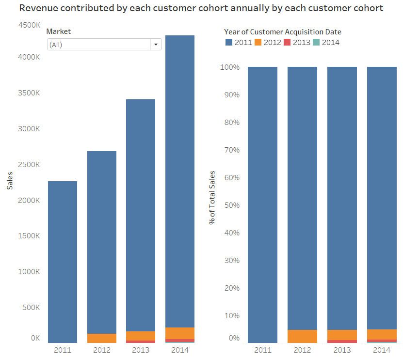
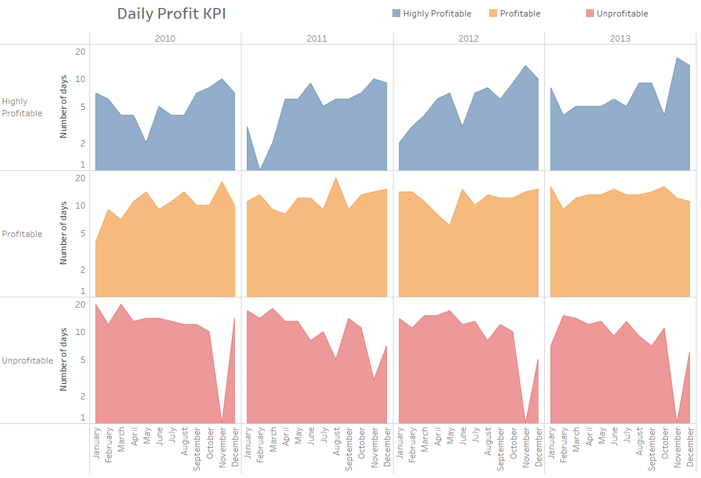
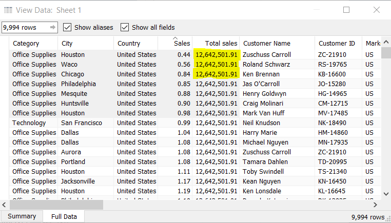
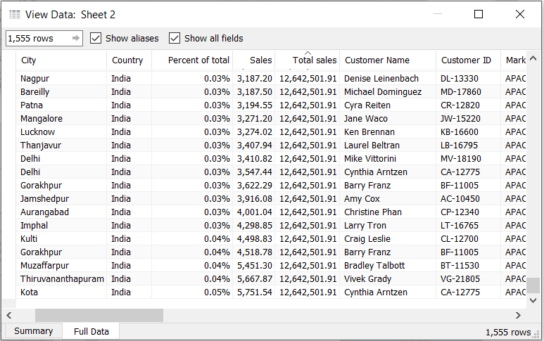
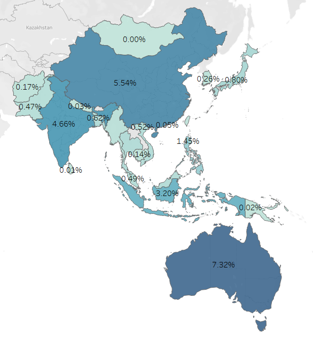
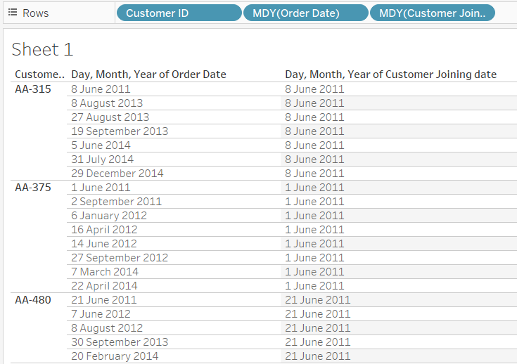
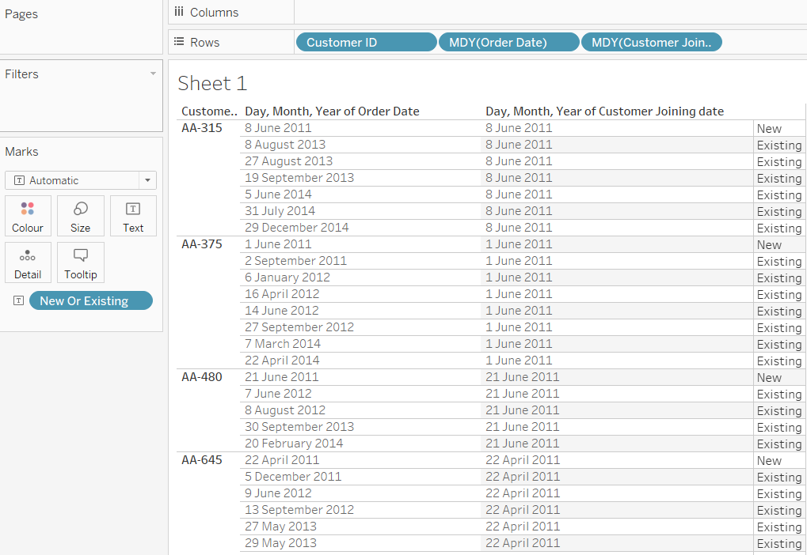
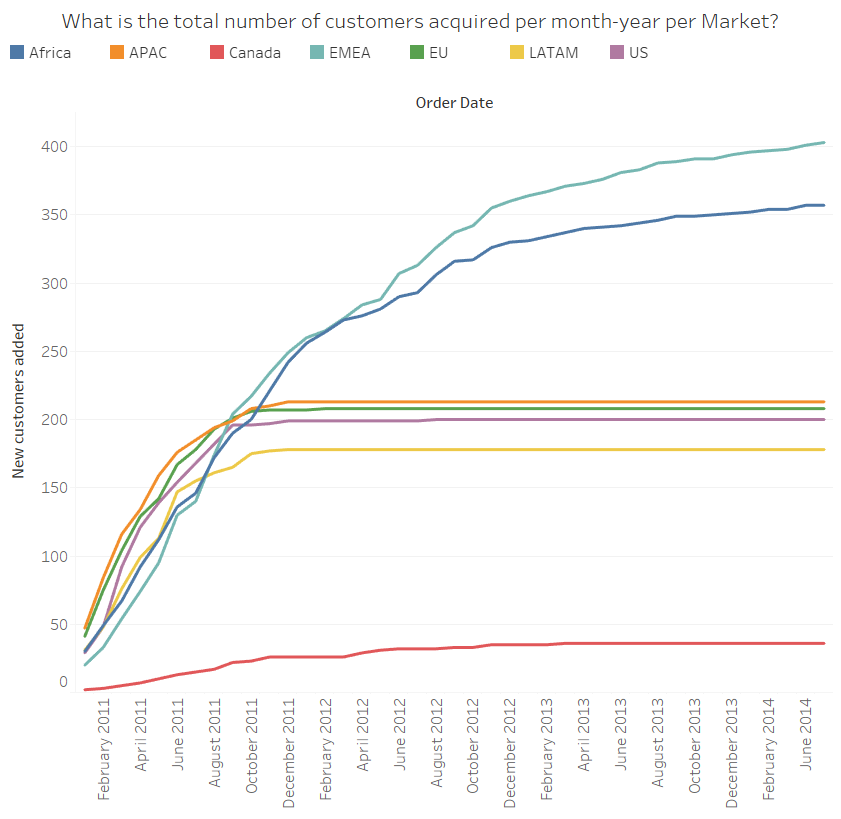

I tried to implement the Tableau visualizations using LOD expressions made in the blog [](https://www.tableau.com/about/blog/LOD-expressions).

Important Tip: Measures are aggregated when added to the view. Adding a dimension will increase the granularity of the view.  


## 1. Customer order frequency

[Download dataset used here](https://www.dropbox.com/s/qmn7q50r6d4i4bc/superstore_sample.xlsx?dl=0)

Number of customers who ordered one order, two orders, three others and four others. To create a histogram of the number of customers who purchased 1,2,3,...N times.  

Steps:
- Create a calculated field __Number of distinct customers__: `COUNTD([Customer ID])` and drag it to Rows shelf and set Marks card to Bar type. 
- Create a calculated field __Number of orders per customer__: `{ FIXED [Customer ID]: COUNTD([Order ID])}` and convert this to dimension.
- Then drag the calculated field __Number of orders per customer__ to the Column shelf and also drag calculated field __Number of distinct customers__ to the color and Label Marks card. Then we get a histogram of the number of customers who purchased 1,2,3,...N times.
- Then do the necessary formatting, title and tooltip modififcation.

[Link to the created visualisation](https://public.tableau.com/views/HistogramofCustomerOrdersCount/Dashboard1?:display_count=y&publish=yes&:origin=viz_share_link)




## 2. Cohort analysis

[Download dataset used here](https://www.dropbox.com/s/ypodk3kminqa7il/Global%20Superstore.xls?dl=0)

To compare a group (cohort) of customers based on their first year of order date and check their contribution to the overall Sales.

Important reference: [Tableau Order of expression evaluation](https://help.tableau.com/current/pro/desktop/en-us/order_of_operations.htm)

Steps:
- Create a calculated field __Customer Acquisition Date__ : `{ FIXED [Customer ID]: MIN([Order Date])}` and it will be a dimension.
- Drag __Sales__ to the Rows Shelf and set Marks card to Bar type and we get a bar graph with _SUM(Sales)_.
- Now to drag the calculated field __Customer Acquisition Date__ to color in the marks card and we get a stacked bar graph for each year in consideration showing the customer cohort year.
- Drag __Market__ to filters card to get the visualization for each market.
- Now duplicate the sheet  and to get percentage of sales for each year do a table calculation

- Now do the formatting, labels and create dashboard.
- [Link to the created visualization](https://public.tableau.com/views/LOD-Revenuecontributedbyeachcustomercohortannuallybyeachcustomercohort/Dashboard1?:display_count=y&publish=yes&:origin=viz_share_link).


## 3. Daily profit KPI

[Download dataset used here](https://www.dropbox.com/s/qmn7q50r6d4i4bc/superstore_sample.xlsx?dl=0)

To know the number of profitable days achieved each month or year, especially if we were curious about seasonal effects. The following view shows how LOD Expressions allow us to easily create bins on aggregated data such as profit per day, while the underlying data is recorded at a transactional level. 

Here we will set KPIS as : 
- __Profit per day__ > 2000 => Highly Profitable
- __Profit per day__ > 0 => Profitable
- __Profit per day__ < 0 => Unprofitable

Steps:
- Need to calculate profit each day using calculated field (and Fixed LOD) __Profit per day__: `{FIXED [Order Date] : SUM([Profit])}`. This helps us to easily bin the days in a secondary calculation.
- Create a calculated field __Daily Profit KPI__ : 
	```
	IF [Profit per day]>2000 THEN "Highly Profitable"
	ELSEIF [Profit per day]>0 THEN "Profitable"
	ELSE 'Unprofitable' END
	```
- Now drag __Order Date__ to columns shelf and keep __YEAR(Order Date)__ and __MONTH(Order Date)__.
- Drag calculated field __Daily Profit KPI__ to Rows shelf.
- Create a calculated field __Count of Distinct order dates__: `COUNTD([Order Date])` and drag it to Rows shelf.
- Select Mark type to Area.
- Drag calculated field __Daily Profit KPI__ to color Marks card.
- [Link to the created visualization](https://public.tableau.com/views/DailyProfitKPI_15854523679980/Dashboard1?:display_count=y&publish=yes&:origin=viz_share_link).


## 4. Percent of total

[Download dataset used here](https://www.dropbox.com/s/ypodk3kminqa7il/Global%20Superstore.xls?dl=0)

Here we will try to find the percentage of sales contributed by each country and also use filter Market.

Steps:
1. To calculate the total sale use fixed LOD. Create a calculated field __Total sales__: `{SUM([Sales])}`. This will create a single column with constant value of total sales.


2. To find the overall sale %ge create calculated field __Percent of total__: `SUM([Sales])/[Total sales]`. This will create a single column which has %ge sale for that row.


3. Now double click on the country to create a map.
4. Drag claculated field __Percent of total__ to color and label marks card.
5. Add Market as quick filer which aids in focussing on a particular Market.
6. APAC Market view with their percentage of total sales value.
 

 [Link to the created visualization](https://public.tableau.com/profile/jeswin.george#!/vizhome/LOD-4Percentageoftotalsales/Dashboard1).

## 5. New customer acquisition

[Download dataset used here](https://www.dropbox.com/s/ypodk3kminqa7il/Global%20Superstore.xls?dl=0)

What is the daily trend of total customer acquisition by market? Finding the trend in this data will help us understand how well the regional marketing and sales organizations are doing at generating new business. The steeper the line, the better the acquisition trend. As a line flattens out, some action must be taken to increase lead flow.

An LOD Expression ensures that repeat customers are not miscounted as new customers, as data must be evaluated at the customer level even though it is displayed visually by market and day.


1. Create a calulated field __Customer Joining Date__: `{ FIXED [Customer ID]: MIN([Order Date])}`
 

2. Now created another calculated field to see for a given _order date_ the customer who ordered was an Existing or a New customer. Named the calculated filed is __New Or Existing__: `IIF([Customer Joining date]=[Order Date], "New", "Existing")`
 

3. Create a 3rd calculated field __Count of distinct customers__: `COUNTD([Customer ID])`
4. Now Drag the field __Order Date__ to columns and convert it to (Months/Year) format.
5. Drag the calculated field __Count of distinct customers__ to rows and do a quick table calculation of _Running Total__ to see all the new customers added over the Month/years.
6. Now drag the calculated filed __New Or Existing__ to filters and select - __New__.
7. Now drag the field __Market__ to colors mark card to see distinct new customers added to each market.
8. Now create a dashboard after doing the necessary formatting.


  [Link to the created visualization](https://public.tableau.com/views/Totalnumberofcustomersacquiredpermonth-yearpermarket/Dashboard1?:display_count=y&publish=yes&:origin=viz_share_link).

## 6. Comparative sales analysis

> It’s relatively straightforward to find the difference from average, but what if you wanted to find the difference from a selected category? First, you must isolate the sales of the selected category. Then an EXCLUDE Expression is needed to repeat that value across all other categories. It is then easy to take the difference of each category’s sales from the rest.  

Steps:  

1. Create a parameter __ Select a Sub-Category__
   

   Worksheet after adding __Sub-category__ and __SUM(Sales)__ to it and after sorting in descending order.

   


2. Need to isolate the sales of sub-category we are interested in this can be done with the help of IF statement and with the help of Parameters to make it more dynamic. So create a calculated field __Selected Sales__: 

```
IF [Sub-Category]=[Select  a Sub-Category]
THEN [Sales] ELSE 0 END
```

Now right click on the parameter made earlier and select _Show Parameter control_.


3. An LOD expression that excludes the category from grouping the sum of selected sales 
will total the selected sales across all rows. This will make it easy to compare the sales of each category to the selected category. So create a calculated field __Sales of Selected Category__ : `{EXCLUDE [Sub-Category]: SUM([Selected Sales])}`.


4. Now create another calculated field __Difference from selected__: `SUM([Sales]) - SUM([Sales of selected category])`

Now do the following changes in workseet to see difference in sales of each sub-category side by side.


5. Now do the necessary formatting and modify tooltips as required.


  [Link to the created visualization](https://public.tableau.com/views/LOD-6Howsalesofacategorycomparetosalesofallcategories/Dashboard1?:retry=yes&:display_count=y&:origin=viz_share_link)


## 7. Average of top deals by sales rep


